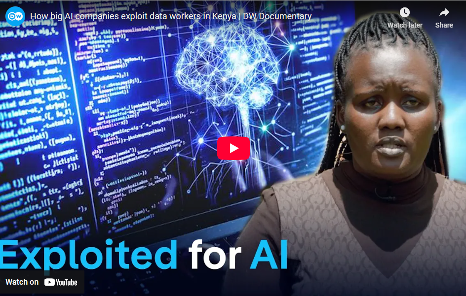

# AI Ethics

## Table of Contents
- [Introduction to AI Ethics](#introduction-to-ai-ethics)
- [Bias in AI](#bias-in-ai)
- [Fairness in AI](#fairness-in-ai)
- [Transparency in AI](#transparency-in-ai)
- [Privacy in AI](#privacy-in-ai)
- [Social Impact of AI](#social-impact-of-ai)
- [Positive vs. Negative Impacts of AI](#positive-vs-negative-impacts-of-ai)
- [Conclusion](#conclusion)
- [References](#references)

## Introduction to AI Ethics

AI Ethics refers to the moral principles and guidelines that govern the development, deployment, and use of artificial intelligence technologies. As AI systems become increasingly integrated into society, it is crucial to address ethical concerns to ensure that these technologies benefit humanity while minimizing harm.

Key ethical topics in AI include:
- **Bias:** Ensuring AI systems do not perpetuate or amplify existing biases.
- **Fairness:** Ensuring AI systems treat all individuals and groups equitably.
- **Transparency:** Making AI systems understandable and accountable.
- **Privacy:** Protecting individuals' data and privacy.
- **Social Impact:** Understanding the broader societal implications of AI technologies.

In this tutorial, we will explore each of these topics in detail, analyze their implications, and discuss the positive and negative impacts of AI on society.

## Bias in AI

**Definition:**
Bias in AI refers to the presence of systematic and unfair discrimination in AI systems, often resulting from biased training data or flawed algorithms.

**Examples:**
- **Hiring Algorithms:** Amazon's AI recruiting tool was found to be biased against women because it was trained on resumes submitted over a 10-year period, most of which came from men.
- **Facial Recognition:** Studies have shown that facial recognition systems have higher error rates for people with darker skin tones, leading to potential discrimination.

**Positive Impacts:**
- **Identifying Bias:** AI can help identify and mitigate human biases in decision-making processes.

**Negative Impacts:**
- **Reinforcing Stereotypes:** AI systems can perpetuate and amplify existing societal biases, leading to unfair treatment of certain groups.

**Fact-Checking:**
- A 2019 study by the National Institute of Standards and Technology (NIST) found that facial recognition algorithms had higher false positive rates for African American and Asian faces compared to Caucasian faces.

## Fairness in AI

**Definition:**
Fairness in AI refers to the equitable treatment of all individuals and groups by AI systems, ensuring that no one is disadvantaged or discriminated against.

**Examples:**
- **Credit Scoring:** AI systems used for credit scoring should ensure that individuals from different demographic groups have equal access to credit.
- **Criminal Justice:** AI systems used for predicting recidivism should not disproportionately target certain racial or ethnic groups.

**Positive Impacts:**
- **Promoting Equity:** AI can help create more equitable systems by removing human biases from decision-making processes.

**Negative Impacts:**
- **Unintended Discrimination:** AI systems can inadvertently discriminate against certain groups if not carefully designed and tested.

**Fact-Checking:**
- A 2016 ProPublica investigation found that the COMPAS algorithm, used to predict recidivism, was biased against African American defendants, labeling them as higher risk compared to white defendants.

## Transparency in AI

**Definition:**
Transparency in AI refers to the ability to understand and explain how AI systems make decisions, ensuring accountability and trust.

**Examples:**
- **Explainable AI (XAI):** Techniques that provide insights into how AI models make decisions, such as feature importance in a decision tree.
- **Algorithmic Audits:** Regular audits of AI systems to ensure they are functioning as intended and not causing harm.

**Positive Impacts:**
- **Building Trust:** Transparent AI systems can build trust among users and stakeholders by providing clear explanations for decisions.
- **Accountability:** Transparency ensures that AI systems can be held accountable for their actions.

**Negative Impacts:**
- **Complexity:** Some AI models, such as deep neural networks, are inherently complex and difficult to interpret, making transparency challenging.

**Fact-Checking:**
- The European Union's General Data Protection Regulation (GDPR) includes a "right to explanation," requiring that individuals be provided with meaningful information about the logic involved in automated decision-making.

## Privacy in AI

**Definition:**
Privacy in AI refers to the protection of individuals' personal data and ensuring that AI systems do not infringe on individuals' privacy rights.

**Examples:**
- **Data Collection:** AI systems often require large amounts of data, raising concerns about how this data is collected, stored, and used.
- **Surveillance:** AI-powered surveillance systems can infringe on individuals' privacy by continuously monitoring and analyzing their behavior.

**Positive Impacts:**
- **Data Anonymization:** AI can be used to anonymize data, protecting individuals' privacy while still enabling valuable insights.
- **Privacy-Preserving Techniques:** Techniques such as federated learning allow AI models to be trained on decentralized data without sharing raw data.

**Negative Impacts:**
- **Data Breaches:** AI systems that collect and store large amounts of personal data are vulnerable to data breaches, potentially exposing sensitive information.
- **Surveillance:** The use of AI for surveillance can lead to a loss of privacy and civil liberties.

**Fact-Checking:**
- A 2021 report by the Pew Research Center found that 79% of Americans are concerned about how companies use their data, highlighting the importance of privacy in AI.

## Social Impact of AI

**Definition:**
The social impact of AI refers to the broader societal implications of AI technologies, including their effects on employment, education, healthcare, and social interactions.

**Examples:**
- **Employment:** AI has the potential to automate many jobs, leading to job displacement in certain industries.
- **Healthcare:** AI can improve healthcare outcomes by enabling early diagnosis and personalized treatment, but it also raises concerns about data privacy and algorithmic bias.

**Positive Impacts:**
- **Economic Growth:** AI can drive economic growth by increasing productivity and creating new industries and job opportunities.
- **Improved Healthcare:** AI can enhance healthcare by enabling more accurate diagnoses, personalized treatments, and efficient resource allocation.

**Negative Impacts:**
- **Job Displacement:** AI-driven automation can lead to job displacement, particularly in industries that rely on routine tasks.
- **Social Inequality:** The benefits of AI may not be evenly distributed, potentially exacerbating social and economic inequalities.

**Fact-Checking:**
- A 2020 report by the World Economic Forum estimated that AI could displace 85 million jobs by 2025 but also create 97 million new roles, highlighting the dual impact of AI on employment.

## Positive vs. Negative Impacts of AI

**Positive Impacts:**
- **Efficiency and Productivity:** AI can automate repetitive tasks, increasing efficiency and productivity across various industries.
- **Innovation:** AI enables new technologies and applications, driving innovation and economic growth.
- **Improved Decision-Making:** AI can provide data-driven insights, improving decision-making in fields such as healthcare, finance, and education.

**Negative Impacts:**
- **Job Displacement:** AI-driven automation can lead to job displacement, particularly in industries that rely on routine tasks.
- **Bias and Discrimination:** AI systems can perpetuate and amplify existing biases, leading to unfair treatment of certain groups.
- **Privacy Concerns:** The widespread use of AI raises concerns about data privacy and surveillance.

**Fact-Checking:**
- A 2019 study by PwC estimated that AI could contribute up to $15.7 trillion to the global economy by 2030, but also highlighted the need for policies to address job displacement and ethical concerns.

## Conclusion

AI Ethics is a critical area of study that addresses the moral principles and guidelines governing the development, deployment, and use of AI technologies. Key ethical topics include bias, fairness, transparency, privacy, and social impact. By understanding and addressing these issues, we can ensure that AI technologies benefit humanity while minimizing harm.

- **Bias:** Ensuring AI systems do not perpetuate or amplify existing biases.
- **Fairness:** Ensuring AI systems treat all individuals and groups equitably.
- **Transparency:** Making AI systems understandable and accountable.
- **Privacy:** Protecting individuals' data and privacy.
- **Social Impact:** Understanding the broader societal implications of AI technologies.

As AI continues to evolve, it is essential to prioritize ethical considerations to create a future where AI technologies are used responsibly and for the greater good.

## References

### Bias in AI
- [NIST Study on Facial Recognition Bias (2019)](https://www.nist.gov/news-events/news/2019/12/nist-study-evaluates-effects-race-age-sex-face-recognition-software): This study highlights the higher false positive rates for African American and Asian faces than for Caucasian faces in facial recognition systems.
- [Amazon's Biased Hiring Algorithm](https://www.reuters.com/article/us-amazon-com-jobs-automation-insight/amazon-scraps-secret-ai-recruiting-tool-that-showed-bias-against-women-idUSKCN1MK08G): This article discusses how Amazon's AI recruiting tool was biased against women.

### Fairness in AI
- [ProPublica Investigation on COMPAS Algorithm (2016)](https://www.propublica.org/article/machine-bias-risk-assessments-in-criminal-sentencing): This investigation reveals how the COMPAS algorithm was biased against African American defendants.
- [AI Fairness in Credit Scoring](https://www.brookings.edu/research/algorithmic-bias-detection-and-mitigation-best-practices-and-policies-to-reduce-consumer-harms/): This report discusses fairness issues in AI systems, including credit scoring.

### Transparency in AI
- [EU GDPR Right to Explanation](https://gdpr-info.eu/art-22-gdpr/): This link explains the "right to explanation" under the GDPR, which requires transparency in automated decision-making.
- [Explainable AI (XAI) by DARPA](https://www.darpa.mil/program/explainable-artificial-intelligence): This page provides an overview of DARPA's efforts to develop explainable AI systems.

### Privacy in AI
- [Pew Research Center Report on Data Privacy (2021)](https://www.pewresearch.org/internet/2021/04/14/americans-and-privacy-concerned-confused-and-feeling-lack-of-control-over-their-personal-information/): This report highlights concerns about data privacy among Americans.
- [Federated Learning for Privacy Preservation](https://ai.googleblog.com/2017/04/federated-learning-collaborative.html): This blog post explains how federated learning can protect privacy while enabling AI model training.

### Social Impact of AI
- [World Economic Forum Report on AI and Jobs (2020)](https://www.weforum.org/reports/the-future-of-jobs-report-2020): This report discusses the potential for AI to displace 85 million jobs while creating 97 million new roles by 2025.
- [AI in Healthcare](https://www.ncbi.nlm.nih.gov/pmc/articles/PMC6616181/): This article explores the benefits and challenges of AI in healthcare, including privacy concerns.

### Positive vs. Negative Impacts of AI
- [PwC Report on AI's Economic Impact (2019)](https://www.pwc.com/gx/en/issues/data-and-analytics/publications/artificial-intelligence-study.html): This report estimates that AI could contribute up to $15.7 trillion to the global economy by 2030.
- [AI and Job Displacement](https://www.mckinsey.com/featured-insights/future-of-work/jobs-lost-jobs-gained-what-the-future-of-work-will-mean-for-jobs-skills-and-wages): This McKinsey report discusses the potential for AI to displace jobs while creating new opportunities.

### Additional Resources
- [AI Ethics Guidelines by the European Commission](https://digital-strategy.ec.europa.eu/en/library/ethics-guidelines-trustworthy-ai): This document outlines ethical guidelines for trustworthy AI.
- [AI Now Institute](https://ainowinstitute.org/): A research institute focused on the social implications of AI, including bias, fairness, and accountability.
- [Partnership on AI](https://www.partnershiponai.org/): A collaborative organization addressing ethical challenges in AI development and deployment.
