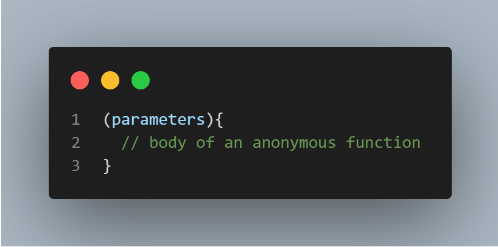

[Repo](https://github.com/PLP-Dart-Projects/dart-week-2-Machuge27.git)

# 1. Functions in Dart

## 🎯 Learning Objectives:

- Understand what Functions are 🤓
- Learn the composition of functions 🔍
- Master different types of functions in Dart 🧑‍💻

## 🔧 FUNCTIONS

In this fun tutorial, we’ll dive into functions in Dart! 🚀 Functions are blocks of code that perform a specific task 🎯. They’re your go-to when you want to reuse code and keep things clean! ✨

### 🌟 Why Functions Are Awesome:

- 🚫 No More Code Repetition
- 🧩 Break complex programs into smaller, manageable parts
- 🧼 Write cleaner and more organized code

### Example 1: Function That Prints Name

This is a simple program that prints a name using a function. The name of the function is `printName()`.

```dart
// Function to print name
void printName() {
    print("My name is Mariam");
}

void main() {
    // Calling the function
    printName();
}
```

### Example 2: Function To Find Sum of Two Numbers

This function finds the sum of two numbers. Here, the function accepts two parameters, `num1` and `num2`, and the return type is void.

```dart
// Function to find the sum of two numbers
void findSum(int num1, int num2) {
    int sum = num1 + num2;
    print("The sum of $num1 and $num2 is: $sum");
}

void main() {
    // Calling the function with two numbers
    findSum(10, 20);
}
```

## 💡 Key Points:

In Dart, functions are also objects—so you can pass them around just like any other object! 🤯

Stick to the lowerCamelCase naming convention for functions 🐪.

Always use lowerCamelCase for your function parameters too 🎯.

## 🛠 Types of Functions:

Functions are blocks of code that perform specific tasks 🧑‍💻. Here are the different types:

### No Parameter and No Return Type:

A function that neither takes any input nor returns any value 🤷‍♂️.

```dart
// No parameter and no return type
void printName() {
    print("Aron Jackson is a student");
}

void main() {
    printName();
}
```

### Parameter and No Return Type:

A function that takes inputs but doesn’t give anything back 🎁.

```dart
// Function with parameters and no return type
void printName(String name) {
    print("My name is $name");
}

void main() {
    printName("Aron Jackson");
}
```

### No Parameter and Return Type:

A function that returns something but doesn’t need any input 💬.

```dart
// Function to return Instructor's name
String instructorName() {
    return "Allan";
}

void main() {
    // Calling the function and storing the result
    String instructor = instructorName();
    print("The Instructor's name is: $instructor");
}
```

### Parameter and Return Type:

A function that takes inputs and gives back a result 🎯.

```dart
// Function to add two integers and return the result
int add(int a, int b) {
    return a + b;
}

void main() {
    // Calling the function with two integers
    int result = add(10, 20);
    print("The sum of 10 and 20 is: $result");
}
```

## THE TYPES OF FUNCTIONS DISCUSSED

The code snippets below indicate all the functions. Use the comments as your guidelines.

```dart
void main() {
    // Calling the functions and displaying their outputs

    // Function with no parameters and no return type
    printWelcomeMessage();

    // Function with parameters and no return type
    greetUser("Alice");

    // Function with parameters and return type
    int sumResult = add(10, 20);
    print("The sum of 10 and 20 is: $sumResult");

    // Function with no parameters but expects a return type
    String instructorName = instructorName();
    print("The instructor's name is $instructorName");

    // Function with parameters and return type
    int productResult = multiply(5, 6);
    print("The product of 5 and 6 is: $productResult");
}

// Function with no parameters and no return type
void printWelcomeMessage() {
    print("Welcome to the Dart programming tutorial!");
}

// Function with parameters and no return type
void greetUser(String name) {
    print("Hello, $name! Welcome to Dart.");
}

// Function with parameters and return type
int add(int a, int b) {
    return a + b;
}

// Function with no parameters but expects a return type
String instructorName() {
    return "Allan";
}

// Function with parameters and return type
int multiply(int a, int b) {
    return a * b;
}
```

Explanation:
- `printWelcomeMessage()`: Prints a welcome message. No parameters and no return type.
- `greetUser(String name)`: Prints a greeting message using the provided name. Takes one parameter and has no return type.
- `add(int a, int b)`: Returns the sum of two integers. Takes two parameters and returns an int.
- `instructorName()`: Returns a fixed string, the instructor's name. No parameters and returns a String.
- `multiply(int a, int b)`: Returns the product of two integers. Takes two parameters and returns an int.


# 2. Anonymous Functions

Welcome to the world of nameless heroes 🎭—also known as anonymous functions, lambdas, or closures! These functions do all the work of regular ones, but without needing a name! 😎

They’re super versatile and can handle zero or many parameters, showing up just when you need them! 🚀 It’s like giving your code a hidden power-up 💥—no name, just pure functionality!

✨ **Pro Tip:** Anonymous functions are awesome for quick, one-time tasks or when you need a function on the fly! 🛠

## Syntax

Below is the syntax of the anonymous function.



### Knowledge Panel:

- You can assign an anonymous function to a variable.
- You can pass an anonymous function as a parameter/argument.

## Example 1: Function to Print Name

```dart
// Function to print name
void printName() {
  print("My name is Mariam");
}

void main() {
  // Calling the function
  printName();
}
```

## Example 1: Anonymous Function to Print Name

```dart
void main() {
  // Anonymous function assigned to the variable `printName`
  var printName = () {
    // Print message inside the anonymous function
    print("My name is Mariam");
  };

  // Call the anonymous function
  printName();
}
```

The anonymous function allows you to define behavior (printing in this case) without giving the function a name. Instead, you store it in a variable (`printName`), which can then be used to call the function. This is useful for temporary or one-off functions that don't need a formal name.

## Example 2: Print All List Items

In this example, you will learn to use an anonymous function to print all list items. This function invokes each fruit without having a function name.

```dart
void main() {
  // List of fruits
  var fruits = ['Apple', 'Banana', 'Cherry', 'Date'];

  // Using an anonymous function with forEach to print each fruit
  fruits.forEach((fruit) {
    print(fruit);
  });
}
```

### Explanation:

- `var fruits = ['Apple', 'Banana', 'Cherry', 'Date'];`: Defines a list of fruits.
- `fruits.forEach((fruit) { ... });`: The `forEach` method is used to iterate over each item in the list. It takes an anonymous function as its argument.
- `(fruit) { print(fruit); }`: This is an anonymous function (a function without a name) that takes one parameter `fruit` and prints it.

## Example 2: Print All List Items

In this example, we will use an anonymous function to print all list items.

```dart
void main() {
  // List of items
  var items = ['Laptop', 'Tablet', 'Smartphone', 'Smartwatch'];

  // Using an anonymous function with forEach to print each item
  items.forEach((item) {
    print(item);
  });
}
```

### Explanation:

- `var items = ['Laptop', 'Tablet', 'Smartphone', 'Smartwatch'];`: Defines a list of items.
- `items.forEach((item) { ... });`: The `forEach` method iterates over each element in the list and applies the provided anonymous function.
- `(item) { print(item); }`: This is an anonymous function that takes one parameter `item` and prints it.


# 4. 🎯 Arrow Functions 🏹

If you want to declare a function in one single line and keep things super sleek, Dart's got your back with the fat arrow function! 🏹✨

It’s as simple as using the `=>` symbol, and boom—you’ve got yourself a one-liner function! 🔥 Perfect for when you’re in a hurry or just want to keep things tidy. 🧹

### Syntax
Below is the syntax for the arrow function:


> **Note:** The arrow function is used to make your code short. `=> expr` syntax is a shorthand for `{ return expr; }`.

### Example 1: Calculation of simple interest without Arrow Function

This program prints name using an arrow function.

```dart
// Simple arrow function to print name
void printName() => print("My name is Mariam");

void main() {
  // Calling the arrow function
  printName();
}
```

This program finds simple interest without using the arrow function:

```dart
void main() {
  // Principal amount, rate of interest, and time period
  double principal = 1000.0;
  double rate = 5.0;
  double time = 3.0;

  // Function to calculate simple interest
  double calculateSimpleInterest(double p, double r, double t) {
    return (p * r * t) / 100;
  }

  // Calling the function and storing the result
  double interest = calculateSimpleInterest(principal, rate, time);

  // Printing the result
  print("The simple interest is: \$${interest}");
}
```

### Example 2: Calculation of simple interest WITH Arrow Function

```dart
void main() {
  // Principal amount, rate of interest, and time period
  double principal = 1000.0;
  double rate = 5.0;
  double time = 3.0;

  // Arrow function to calculate simple interest
  double calculateSimpleInterest = (double p, double r, double t) => (p * r * t) / 100;

  // Calling the function and storing the result
  double interest = calculateSimpleInterest(principal, rate, time);

  // Printing the result
  print("The simple interest is: \$${interest}");
}
```
