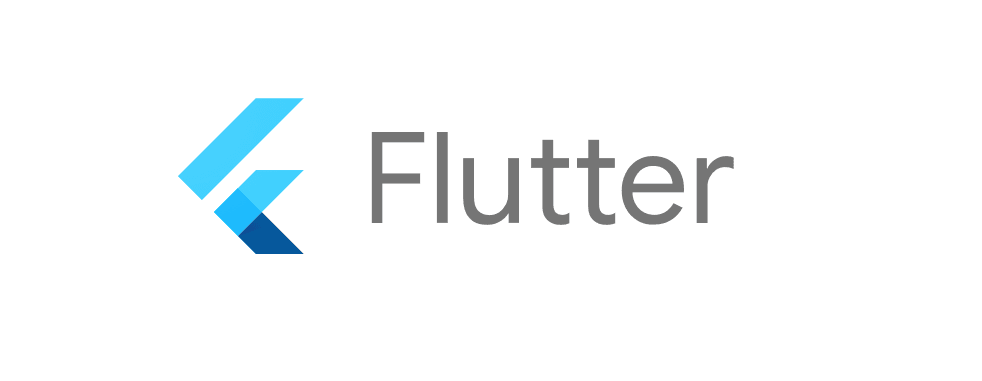

[Repo](https://github.com/PLP-Dart-Projects/dart-week-5-Machuge27.git)
# 1. Introduction to Flutter

## Learning Objectives:
- Understand what Flutter is and its role in cross-platform development.
- Learn the benefits of using Flutter.
- Set up the Flutter SDK and development environment.
- Create simple UI elements using Flutter widgets.
- Build a basic Flutter app using stateless widgets.

## Understanding Flutter

### What is Flutter?

**Introduction to Flutter:** Flutter is an open-source UI software development kit (SDK) by Google that allows developers to create high-performance, natively compiled applications for mobile, web, and desktop from a single codebase. By using Flutter, developers can simplify app development with a unified framework that works across different platforms, reducing the complexity and time involved in managing multiple codebases.

### Architecture of Flutter:

- **Flutter Framework:** Built using the Dart programming language, Flutter is centered around a widget-based architecture. In Flutter, everything is a widget, from basic UI elements like buttons to entire screens. These widgets are highly customizable and reusable, allowing developers to efficiently build consistent user interfaces across platforms.
- **Rendering Engine:** Flutter uses the Impeller rendering engine. Impeller precompiles a smaller, simpler set of shaders at Engine-build time so they don't compile at runtime.

### Benefits of Flutter:

- **Hot Reload:** One of Flutter’s most powerful features is hot reload, which allows developers to instantly see the effects of code changes without restarting the entire app. This feature speeds up development by enabling quick iterations and experimentation.
- **Single Codebase:** Flutter enables developers to maintain a single codebase that can be used to create apps for multiple platforms, including Android, iOS, web, and desktop. This significantly reduces development time and costs.
- **Rich Set of Widgets:** Flutter comes with a comprehensive library of pre-designed widgets that are both beautiful and customizable. These widgets adhere to the design guidelines of both Android (Material Design) and iOS (Cupertino), ensuring that apps built with Flutter provide a native-like experience on each platform.

### Real-World Applications:

Some popular applications built with Flutter include the Google Ads app, Reflectly, and Alibaba. These apps benefit from Flutter’s rapid development cycles and consistent performance across platforms.

### Key Points:

- Flutter is a versatile and powerful framework for cross-platform development.
- It uses a single codebase for multiple platforms, making it an efficient tool for developers.
- Flutter’s architecture revolves around widgets, with hot reload enabling quick iterations and testing.

# 2. Installing Flutter SDK

## For Windows

### Download Flutter SDK:

1. Visit [Flutter SDK](https://docs.flutter.dev/get-started/install/windows/mobile).
2. Download the `.zip` file for Windows.

### Extract the Flutter SDK:

1. Extract the downloaded `.zip` file to `C:\src\flutter`.

### Add Flutter to System PATH:

1. Open System Properties:
    - Press `Win + Pause`.
    - Click `Advanced system settings` > `Environment Variables`.
2. Edit the `Path` variable under System Variables:
    - Add the path to the `flutter\bin` directory. Example:
      ```
      C:\src\flutter\bin
      ```

3. Save and close.

### Verify Installation:

1. Open Command Prompt and run:
    ```
    flutter doctor
    flutter --version
    ```

2. Follow instructions to resolve any missing dependencies.

## For Linux

### Download Flutter SDK:

1. Open terminal and run:
    ```
    cd ~/Downloads
    wget https://storage.googleapis.com/flutter_infra_release/releases/stable/linux/flutter_linux_latest.tar.xz
    ```

### Extract the Flutter SDK:

1. Run:
    ```
    sudo tar -xf flutter_linux_latest.tar.xz -C /opt
    ```

### Add Flutter to PATH:

1. Open `.bashrc` file:
    ```
    nano ~/.bashrc
    ```

2. Add the following line at the end:
    ```
    export PATH="/opt/flutter/bin:$PATH"
    ```

3. Apply the changes:
    ```
    source ~/.bashrc
    ```

### Verify Installation:

1. Run:
    ```
    flutter doctor
    flutter --version
    ```

## For macOS

### Download Flutter SDK:

1. Open terminal and run:
    ```
    cd ~/Downloads
    wget https://storage.googleapis.com/flutter_infra_release/releases/stable/macos/flutter_macos_latest.zip
    ```

### Extract the Flutter SDK:

1. Run:
    ```
    sudo unzip flutter_macos_latest.zip -d /opt
    ```

### Add Flutter to PATH:

1. Open `.zshrc` file:
    ```
    nano ~/.zshrc
    ```

2. Add the following line at the end:
    ```
    export PATH="/opt/flutter/bin:$PATH"
    ```

3. Apply the changes:
    ```
    source ~/.zshrc
    ```

### Verify Installation:

1. Run:
    ```
    flutter doctor
    flutter --version
    ```

# 3. Getting Started with Flutter Widgets

## What are Widgets?

Widgets are the building blocks of a Flutter app's user interface. In Flutter, everything you see on the screen is a widget, whether it’s a text, image, or button. Even structural elements like rows, columns, and layouts are widgets.

Flutter uses a widget tree to determine how widgets are arranged and displayed. Widgets are lightweight and designed to be reusable.

## Types of Widgets

Flutter provides two main types of widgets based on their state:

### StatelessWidget

These widgets are immutable, meaning their state cannot change after they are built.

**Examples:** Text, Icon, AppBar.

Use when the UI remains static.

### StatefulWidget

These widgets are mutable, meaning they can change their state during runtime.

**Examples:** Checkbox, Slider, TextField.

Use when the UI needs to update dynamically based on user interactions or data changes.

## Building a Simple UI with Widgets

By combining different widgets, you can build complex UIs. For example:

- Use a `Column` widget to arrange a group of widgets vertically.
- Wrap a `Text` widget inside a `Padding` widget to add space around the text.
- Place a `Button` widget within a `Container` to style it with background color, padding, and borders.

## Key Takeaways

- Widgets are reusable components that build the Flutter UI.
- Use `StatelessWidget` for static UI elements.
- Use `StatefulWidget` for interactive or dynamic UI elements.
- Familiarize yourself with common widgets like `Text`, `Container`, `Buttons`, and `Lists`, as they form the core of most Flutter apps.

## Creating a Basic Flutter App

### Step 1: Create a New Flutter Project

1. **Open Your IDE:** Start by launching Visual Studio Code.
2. **Create a New Flutter Project:**
    - Open a terminal or command prompt.
    - Create a new Flutter project using the `flutter create` command:
      ```sh
      flutter create your_project_name
      ```
      Replace `your_project_name` with your desired project name.
    - Alternatively, use Visual Studio Code's command palette:
      - Open the command palette: Press `Ctrl + Shift + P` (Windows/Linux) or `Cmd + Shift + P` (macOS).
      - Type `Flutter: New Project`: Start typing "Flutter: New Project" and select it when it appears in the list.
      - Name your project and choose a location: Enter a name for your project and select a location on your file system to save it.
3. **Open the `main.dart` file:**
    - Navigate to the `lib` folder within your project.
    - Open the `main.dart` file to start editing your Flutter application's entry point.

### Step 2: Modify the `main.dart` File

Replace the default code in `main.dart` and replace it with the following:

```dart
import 'package:flutter/material.dart';

void main() {
  runApp(MyApp());
}

class MyApp extends StatelessWidget {
  @override
  Widget build(BuildContext context) {
     return MaterialApp(
        home: Scaffold(
          appBar: AppBar(
             title: Text('Hello Flutter App'),
          ),
          body: MyHomePage(),
        ),
     );
  }
}

class MyHomePage extends StatelessWidget {
  @override
  Widget build(BuildContext context) {
     return Center(
        child: Column(
          mainAxisAlignment: MainAxisAlignment.center,
          children: <Widget>[
             Text(
                'Hello, Flutter!',
                style: TextStyle(fontSize: 24),
             ),
             SizedBox(height: 20),
             ElevatedButton(
                onPressed: () {
                  print('Button Pressed!');
                },
                child: Text('Press Me Please'),
             ),
             SizedBox(height: 20),
             Image.network(
                'https://tinyurl.com/bdfd544u',
             ),
          ],
        ),
     );
  }
}
```

### Explanation of the Code

- `import 'package:flutter/material.dart';`: This line imports the Flutter material design library, which contains pre-designed widgets that adhere to the Material Design guidelines.
- `runApp(MyApp());`: This function is the entry point of the app. It loads the `MyApp` widget.
- `StatelessWidget`: The `MyApp` and `MyHomePage` classes extend `StatelessWidget`, meaning they are immutable and do not maintain any internal state.
- `MaterialApp`: This widget acts as the root of the app, setting up various properties like the home screen and themes.
- `Scaffold`: Provides the basic visual structure for the app, including an app bar and a body.
- `AppBar`: This widget displays a title at the top of the app.
- `Center`: Centers its child widgets within itself.
- `Column`: Arranges its children vertically.
- `Text`: Displays the "Hello, Flutter!" text.
- `ElevatedButton`: A button that triggers an action (printing to the console) when pressed.
- `Image.network`: Displays an image from a provided URL.

### Step 3: Run the App

1. **Run the Flutter App:**
    - In Visual Studio Code: Open the terminal and type `flutter run`.
2. **Interact with the App:**
    - You should see "Hello, Flutter!" text in the center of the screen, a button labeled "Press Me" that prints "Button Pressed!" to the console when clicked, and an image loaded from the internet below the button.
3. **View Console Output:** Check the console in your IDE to see the "Button Pressed!" message when the button is clicked.

# Class Live Recording

## Lesson 1

[Watch the recording](https://powerlearnproject-org.zoom.us/rec/share/yP4RqgMBzdkNbHHVa4GjMATGrBL1AEmb7gZl4_jJDnyapqd5ulZXU3-S05n7mYbU.9w8Dlk263T-WEjjF)

## Additional Info

In Flutter, the best way to pass data between widgets is:

**C. By using the Provider package or passing data through the widget tree.**

### Explanation of Options:

- **A. By using global variables.**
  - While you can use global variables, it's generally not recommended as it can lead to tight coupling and difficulties in maintaining state.

- **B. By using the setState() method.**
  - `setState()` is used to update the state of a widget, but it doesn't inherently facilitate passing data between widgets.

- **C. By using the Provider package or passing data through the widget tree.**
  - This is the most effective method. The Provider package allows for state management and data sharing across the widget tree, while passing data through constructors is a straightforward way to share data directly.

- **D. There is no way to pass data between widgets in Flutter.**
  - This statement is false; there are multiple ways to share data between widgets.

### Conclusion
Using the Provider package or passing data through the widget tree is the recommended approach for managing and sharing data in Flutter applications.

The **BuildContext** object in Flutter is primarily used for:

**A. To access the current widget tree and its properties.**

### Explanation of Options:

- **A. To access the current widget tree and its properties.**
  - Correct. The `BuildContext` provides information about the location of a widget in the widget tree and allows you to access the widget's properties and methods.

- **B. To define the layout of a widget.**
  - Incorrect. The layout is defined by the widget itself, not by the `BuildContext`.

- **C. To handle navigation between screens.**
  - Partially correct. While `BuildContext` can be used for navigation, it is not its primary purpose.

- **D. To manage the state of a widget.**
  - Incorrect. State management is handled through stateful widgets and other state management solutions, not directly by `BuildContext`.


The purpose of the **setState()** method in a **StatefulWidget** is:

**A. To update the state of the widget and trigger a rebuild.**

### Explanation of Options:

- **A. To update the state of the widget and trigger a rebuild.**
  - Correct. Calling `setState()` notifies the framework that the internal state of the widget has changed, prompting a rebuild of the widget.

- **B. To change the properties of the widget.**
  - Incorrect. While `setState()` can lead to changes in properties, its primary role is to update state and trigger a rebuild.

- **C. To call the build() method.**
  - Incorrect. `setState()` does not directly call the `build()` method; it triggers the framework to call it when the state changes.

- **D. To handle user input.**
  - Incorrect. User input can be processed in various ways, but `setState()` itself is not specifically for handling input.
