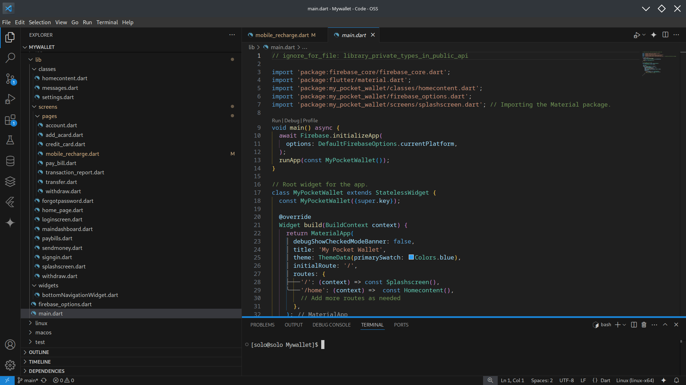

# Session 1: Introduction to Basic Widgets and Layouts

## Objectives:
- Understand fundamental widgets in Flutter.
- Implement basic layouts using common Flutter widgets.

## Lesson Notes:
During this live session, we will focus on learning Flutter’s core widgets and layouts by building a simple user interface together. The project will be done collaboratively in class, where each step will be demonstrated, and you will follow along by coding live.

### 1. Exploring Basic Widgets:
We will introduce and discuss key widgets like `Container`, `Row`, `Column`, `Text`, `Button`, and `Image`. These widgets will be used to create a basic UI, where we will cover properties, styling, and typical use cases.

#### Live Project:
Together, we will build a simple UI with a welcome message, a container styled with colors, and a button that reacts to user interactions. You’ll gain hands-on experience in arranging and customizing widgets.

### 2. Creating Basic Layouts:
We will explore common layout widgets such as `Column`, `Row`, `Stack`, and `GridView`. You'll work on building a basic layout, which will include creating a login screen using `Column` and `Row` widgets.

#### Live Project:
We will design a basic layout for a login page. The emphasis will be on arranging widgets in rows and columns, adding padding, and creating a user-friendly structure.

# Session 2: Implementing Navigation and Routing

## Objectives:
- Learn how to navigate between different screens.
- Implement basic routing and navigation features.

## Lesson Notes:
In this live session, we will explore navigation in Flutter. By the end of the session, you will have hands-on experience with transitioning between screens.

### 1. Understanding Navigation in Flutter:
We will explore how the `Navigator` widget handles screen transitions and navigation. The concept of push and pop will be demonstrated live, showing how screens are added to and removed from the stack.

#### Live Project:
As a class, we will implement navigation between the login page and a dashboard page. You will learn how to set up routes and trigger navigation on button presses.

### 2. Implementing Named Routes:
We will introduce named routes and explain how they simplify navigation management.


#### Live Project:
We will set up named routes for various pages (e.g., Send Money, Pay Bills) and implement navigation between them. We will also test the back navigation feature.

# Session 3: Designing the Dashboard and Core Features

## Objectives:
- Develop the main dashboard layout.
- Create core features like sending money and paying bills.

## Lesson Notes:
In this live coding session, we will focus on designing a functional dashboard and core features of the app. By coding live together, you’ll build critical components and features that form the heart of the app.

### 1. Designing the Dashboard:
We will discuss how to use layout widgets like `GridView` and `Card` to design the main dashboard.

#### Live Project:
Together, we will create a dashboard with different sections representing features like sending money and checking account balance.

### 2. Implementing Core Features:
We will focus on building UI elements for sending money and paying bills.

#### Live Project:
We will work on the send money and pay bills pages, designing the necessary input fields and integrating them into the app.

# Steps to Add Screens

After running `flutter create` command, a flutter project will be created with a folder structure like below.


Inside the `lib` directory, create another folder called `screens`.



While in the `screens` directory create a file called `splashscreen.dart` and add the code snippet below for the splash screen.

## Splash Screen


```dart
import 'package:flutter/material.dart';
import 'package:my_pocket_wallet/screens/loginscreen.dart';

class Splashscreen extends StatefulWidget {
    const Splashscreen({Key? key}) : super(key: key);

    @override
    _SplashscreenState createState() => _SplashscreenState();
}

class _SplashscreenState extends State<Splashscreen> {
    @override
    Widget build(BuildContext context) {
        return SafeArea(
                child: Scaffold(
            backgroundColor: Colors.blue.shade500,
            body: Column(
                mainAxisAlignment: MainAxisAlignment.start,
                children: [
                    Flexible(child: _topImageSection()),
                    _middleScreenText(),
                    _spashButton(context),
                ],
            ),
        ));
    }
}

Widget _topImageSection() {
    return Container(
        child: Center(child: Image.asset("assets/images/splash.png")),
    );
}

Widget _middleScreenText() {
    return Container(
        child: const Column(
            children: [
                Text("User Sunday"),
                SizedBox(
                    height: 16,
                ),
                Text("Welcome to blur blur...."),
            ],
        ),
    );
}

Widget _spashButton(context) {
    return Container(
        child: Row(
            mainAxisAlignment: MainAxisAlignment.end,
            children: [
                FloatingActionButton(
                    shape: const RoundedRectangleBorder(
                        borderRadius: BorderRadius.all(
                            Radius.circular(30),
                        ),
                        side: BorderSide(
                            width: 2.0,
                        ),
                    ),
                    onPressed: () {
                        Navigator.push(
                            context,
                            MaterialPageRoute(builder: (context) => DashboardPage()),
                        );
                    },
                    child: const Icon(Icons.arrow_forward),
                ),
            ],
        ),
    );
}
```

# Adding Assets

At the root of the project (where there is `pubspec.yaml`) create a folder called `assets` inside the assets folder create a folder named `images` and add all your images in this folder.

## Registering Images in `pubspec.yaml` file

Open `pubspec.yaml` folder then register your images as shown in the image below.


# Navigating to the Dashboard

Once the forward arrow is clicked, you should be prompted to add main dashboard screen.

## Main dashboard screen

Inside the `screens` folder, create another screen called `maindashboard.dart`

Add the following code to `maindashboard.dart`


```dart
import 'package:flutter/material.dart';
import 'sendmoney.dart';

class DashboardPage extends StatelessWidget {
    const DashboardPage({super.key});

    @override
    Widget build(BuildContext context) {
        return Scaffold(
            appBar: AppBar(
                title: const Text('Dashboard'),
            ),
            body: Padding(
                padding: const EdgeInsets.all(16.0),
                child: Column(
                    crossAxisAlignment: CrossAxisAlignment.start,
                    children: [
                        _greetUser(),
                        const SizedBox(height: 20),
                        _accountBalance(),
                        const SizedBox(height: 40),
                        _paymentType(context),
                    ],
                ),
            ),
        );
    }

    Widget _greetUser() {
        return const SizedBox(
            child: Text(
                'Hello, User!',
                style: TextStyle(
                    fontSize: 24,
                    fontWeight: FontWeight.bold,
                ),
            ),
        );
    }
}

Widget _accountBalance() {
    return Container(
        padding: const EdgeInsets.all(16),
        decoration: BoxDecoration(
            color: Colors.blueAccent,
            borderRadius: BorderRadius.circular(12),
        ),
        child: const Column(
            crossAxisAlignment: CrossAxisAlignment.start,
            children: [
                Text(
                    'Account Balance',
                    style: TextStyle(
                        color: Colors.white,
                        fontSize: 18,
                    ),
                ),
                SizedBox(height: 10),
                Text(
                    '\$12,345.67',
                    style: TextStyle(
                        color: Colors.white,
                        fontSize: 32,
                        fontWeight: FontWeight.bold,
                    ),
                ),
            ],
        ),
    );
}

Widget _paymentType(BuildContext context) {
    return Column(
        mainAxisAlignment: MainAxisAlignment.center,
        children: [
            ElevatedButton(
                onPressed: () {
                    Navigator.push(
                        context,
                        MaterialPageRoute(builder: (context) => const SendMoneyPage()),
                    );
                },
                style: ElevatedButton.styleFrom(
                    padding: const EdgeInsets.symmetric(vertical: 15, horizontal: 30),
                    textStyle: const TextStyle(fontSize: 18),
                ),
                child: const Text('Send Money'),
            ),
            const SizedBox(height: 20),
            ElevatedButton(
                onPressed: () {},
                style: ElevatedButton.styleFrom(
                    padding: const EdgeInsets.symmetric(vertical: 15, horizontal: 30),
                    textStyle: const TextStyle(fontSize: 18),
                ),
                child: const Text('Pay Bills'),
            ),
            const SizedBox(height: 20),
            ElevatedButton(
                onPressed: () {},
                style: ElevatedButton.styleFrom(
                    padding: const EdgeInsets.symmetric(vertical: 15, horizontal: 30),
                    textStyle: const TextStyle(fontSize: 18),
                ),
                child: const Text('Withdraw'),
            )
        ],
    );
}
```

# Transfer Money screen

Inside the `screens` folder create a file called `sendmoney.dart` and add the code below.

```dart
import 'package:flutter/material.dart';

class SendMoneyPage extends StatefulWidget {
    const SendMoneyPage({super.key});

    @override
    _SendMoneyPageState createState() => _SendMoneyPageState();
}

class _SendMoneyPageState extends State<SendMoneyPage> {
    String recipient = '';
    double amount = 0.0;
    String paymentMethod = '';

    void _confirmTransaction() {
        if (recipient.isNotEmpty && amount > 0 && paymentMethod.isNotEmpty) {
            Navigator.push(
                context,
                MaterialPageRoute(
                    builder: (context) => TransactionConfirmationPage(
                        recipient: recipient,
                        amount: amount,
                        paymentMethod: paymentMethod,
                    ),
                ),
            );
        } else {
            ScaffoldMessenger.of(context).showSnackBar(
                const SnackBar(content: Text('Please fill all fields')),
            );
        }
    }

    @override
    Widget build(BuildContext context) {
        return Scaffold(
            appBar: AppBar(title: const Text('Send Money')),
            body: Padding(
                padding: const EdgeInsets.all(16.0),
                child: Column(
                    children: [
                        TextField(
                            decoration: const InputDecoration(labelText: 'Recipient'),
                            onChanged: (value) {
                                setState(() {
                                    recipient = value;
                                });
                            },
                        ),
                        const SizedBox(height: 16),
                        TextField(
                            decoration: const InputDecoration(labelText: 'Amount'),
                            keyboardType: TextInputType.number,
                            onChanged: (value) {
                                setState(() {
                                    amount = double.tryParse(value) ?? 0.0;
                                });
                            },
                        ),
                        const SizedBox(height: 16),
                        DropdownButtonFormField<String>(
                            decoration: const InputDecoration(labelText: 'Payment Method'),
                            value: paymentMethod.isEmpty ? null : paymentMethod,
                            items: const [
                                DropdownMenuItem(
                                    value: 'Bank Account',
                                    child: Text('Bank Account'),
                                ),
                                DropdownMenuItem(
                                    value: 'Mobile Wallet',
                                    child: Text('Mobile Wallet'),
                                ),
                            ],
                            onChanged: (value) {
                                setState(() {
                                    paymentMethod = value ?? '';
                                });
                            },
                        ),
                        const SizedBox(height: 16),
                        ElevatedButton(
                            onPressed: _confirmTransaction,
                            child: const Text('Proceed to Confirm'),
                        ),
                    ],
                ),
            ),
        );
    }
}

class TransactionConfirmationPage extends StatelessWidget {
    final String recipient;
    final double amount;
    final String paymentMethod;

    const TransactionConfirmationPage({
        Key? key,
        required this.recipient,
        required this.amount,
        required this.paymentMethod,
    }) : super(key: key);

    @override
    Widget build(BuildContext context) {
        return Scaffold(
            appBar: AppBar(title: const Text('Confirm Transaction')),
            body: Padding(
                padding: const EdgeInsets.all(16.0),
                child: Column(
                    crossAxisAlignment: CrossAxisAlignment.start,
                    children: [
                        const Text('Transaction Details', style: TextStyle(fontSize: 18, fontWeight: FontWeight.bold)),
                        const SizedBox(height: 16),
                        Text('Recipient: $recipient'),
                        Text('Amount: \$${amount.toStringAsFixed(2)}'),
                        Text('Payment Method: $paymentMethod'),
                        const SizedBox(height: 20),
                        ElevatedButton(
                            onPressed: () {
                                ScaffoldMessenger.of(context).showSnackBar(
                                    const SnackBar(content: Text('Transaction Successful')),
                                );
                                Navigator.popUntil(context, (route) => route.isFirst);
                            },
                            child: const Text('Confirm and Send'),
                        ),
                        const SizedBox(height: 10),
                        TextButton(
                            onPressed: () {
                                Navigator.pop(context);
                            },
                            child: const Text('Cancel'),
                        ),
                    ],
                ),
            ),
        );
    }
}
```


# Github Repository Link

[Mywallet](https://github.com/Lenkaa3792/Mywallet)

## Lesson 1

[Lesson 1 Recording](https://powerlearnproject-org.zoom.us/rec/share/l1zs5CiHmoCDvWtKvjVNN2zSb_gqPMB-t4QOoC9qNC6fDaP5PPA8La1P2nOfhQ.t2QrOh-CWf7mtHE2)

## Lesson 2

[Lesson 2 Recording](https://powerlearnproject-org.zoom.us/rec/share/2we6q5cmc2AGKIf8vjNiMqL__ds7D82b58rCUjfqN92aJlC_vu_-EoMedfVzN5H-.tJft581q8fmtcfUu)


## Additional:

In the Provider package of Flutter, **ValueNotifier** and **ChangeNotifier** are both used for state management, but they serve different purposes and have different characteristics. Here’s a breakdown of the differences:

### ValueNotifier
- **Purpose**: Specifically designed to hold a single value that can change over time.
- **Usage**: Ideal for simple state management where you only need to notify listeners about changes to a single value.
- **Implementation**: Extends `ValueNotifier<T>`, and you can use it as follows:
  ```dart
  ValueNotifier<int> counter = ValueNotifier<int>(0);
  ```
- **Listeners**: Automatically notifies listeners when the value changes. You can access the value using `value` property.
- **Example**:
  ```dart
  ValueListenableBuilder<int>(
    valueListenable: counter,
    builder: (context, value, child) {
      return Text('Counter: $value');
    },
  );
  ```

### ChangeNotifier
- **Purpose**: More general-purpose and can hold multiple values or complex state.
- **Usage**: Suitable for more complex scenarios where you need to notify listeners about changes in multiple properties.
- **Implementation**: Extends `ChangeNotifier`, and you can define multiple fields and methods within it.
  ```dart
  class MyModel extends ChangeNotifier {
    int _count = 0;

    int get count => _count;

    void increment() {
      _count++;
      notifyListeners();
    }
  }
  ```
- **Listeners**: You need to call `notifyListeners()` manually whenever you change a property.
- **Example**:
  ```dart
  ChangeNotifierProvider(
    create: (context) => MyModel(),
    child: Consumer<MyModel>(
      builder: (context, model, child) {
        return Text('Count: ${model.count}');
      },
    ),
  );
  ```

### Summary
- **ValueNotifier**: Best for single value tracking and simpler use cases.
- **ChangeNotifier**: Best for managing complex state with multiple properties and requires manual notification of listeners.

Choose between them based on the complexity of the state you need to manage!

The `BuildContext` object in Flutter serves several important purposes:

### 1. **Tree Structure Reference**
- **Hierarchy**: `BuildContext` provides a reference to the location of a widget in the widget tree. This context allows widgets to access their parent and ancestor widgets.
- **Access to Ancestors**: You can use it to find ancestor widgets, which is useful for accessing inherited widgets like `Theme` or `MediaQuery`.

### 2. **Widget Lifecycle**
- **Build Method**: The `BuildContext` is passed to the `build` method of a widget, allowing the widget to build itself based on its context in the widget tree.
- **State Management**: It helps manage the lifecycle of widgets, especially in stateful widgets, by providing context when calling `setState()`.

### 3. **Dependency Injection**
- **Provider and InheritedWidgets**: `BuildContext` is essential for accessing data provided by `Provider`, `InheritedWidget`, or similar patterns. You can retrieve data from the nearest ancestor widget using methods like `Provider.of<T>(context)`.

### 4. **Navigation**
- **Routing**: It is used for navigation operations, such as pushing new routes onto the navigator stack. For example:
  ```dart
  Navigator.of(context).push(MaterialPageRoute(builder: (context) => NewPage()));
  ```

### 5. **Theme and Media Queries**
- **Accessing Themes**: You can obtain theme data using `Theme.of(context)`, which allows you to style your widgets according to the current theme.
- **Screen Size and Orientation**: Access screen dimensions and orientation using `MediaQuery.of(context)`.

### Summary
- **Reference**: Provides a reference to the widget's position in the tree.
- **Access**: Allows access to ancestor widgets and inherited data.
- **Lifecycle**: Plays a role in the widget lifecycle and state management.
- **Navigation**: Facilitates navigation and routing.
- **Styling**: Helps access themes and media queries for responsive design.

In essence, `BuildContext` is a fundamental part of Flutter's widget system, enabling widgets to interact with their environment effectively!

The `FutureBuilder` widget in Flutter is used to build a widget based on the latest snapshot of interaction with a `Future`. It is particularly useful for handling asynchronous operations such as fetching data from a server or performing time-consuming computations. Here’s a detailed overview of its purpose and usage:

### Purpose of FutureBuilder

1. **Asynchronous Data Handling**:
   - `FutureBuilder` simplifies the process of working with asynchronous data by allowing you to build your UI based on the state of a `Future`.

2. **Snapshot Management**:
   - It provides a `snapshot` object that contains information about the current state of the `Future`, including whether it is still loading, completed successfully, or encountered an error.

3. **Dynamic UI Updates**:
   - The widget automatically rebuilds itself when the `Future` completes, allowing the UI to reflect the latest data or error state without manual intervention.

### Usage

Here’s how to use `FutureBuilder`:

1. **Define a Future**: Create a `Future` that performs an asynchronous operation.

2. **Use FutureBuilder**: Wrap your UI code in a `FutureBuilder` widget, providing the `Future` and a builder function.

3. **Handle Different States**: Use the `snapshot` to determine whether the data is still loading, has completed successfully, or has failed.

### Example

Here’s a simple example of using `FutureBuilder` to fetch data:

```dart
import 'package:flutter/material.dart';

void main() {
  runApp(MyApp());
}

class MyApp extends StatelessWidget {
  @override
  Widget build(BuildContext context) {
    return MaterialApp(
      home: Scaffold(
        appBar: AppBar(title: Text('FutureBuilder Example')),
        body: Center(
          child: FutureBuilder<String>(
            future: fetchData(), // Your async function
            builder: (BuildContext context, AsyncSnapshot<String> snapshot) {
              if (snapshot.connectionState == ConnectionState.waiting) {
                // While the future is loading
                return CircularProgressIndicator();
              } else if (snapshot.hasError) {
                // If the future encountered an error
                return Text('Error: ${snapshot.error}');
              } else {
                // When the future is complete
                return Text('Data: ${snapshot.data}');
              }
            },
          ),
        ),
      ),
    );
  }

  Future<String> fetchData() async {
    await Future.delayed(Duration(seconds: 2)); // Simulating network delay
    return 'Hello, World!';
  }
}
```

### Summary

- **Asynchronous Operations**: Handles loading, success, and error states of asynchronous data.
- **Automatic Rebuilds**: Automatically rebuilds the UI when the `Future` state changes.
- **Snapshot Management**: Provides access to the `snapshot` to determine the current state of the `Future`.

`FutureBuilder` is a powerful tool in Flutter for managing asynchronous data and updating the UI accordingly!