## Recap SQL INSERT Clause:

In SQL, the INSERT statement is used to add new records or rows into a table. This fundamental operation is vital for populating a database with data. The INSERT statement allows you to specify the values for each column or copy data from another table, enabling you to dynamically grow and maintain your database.

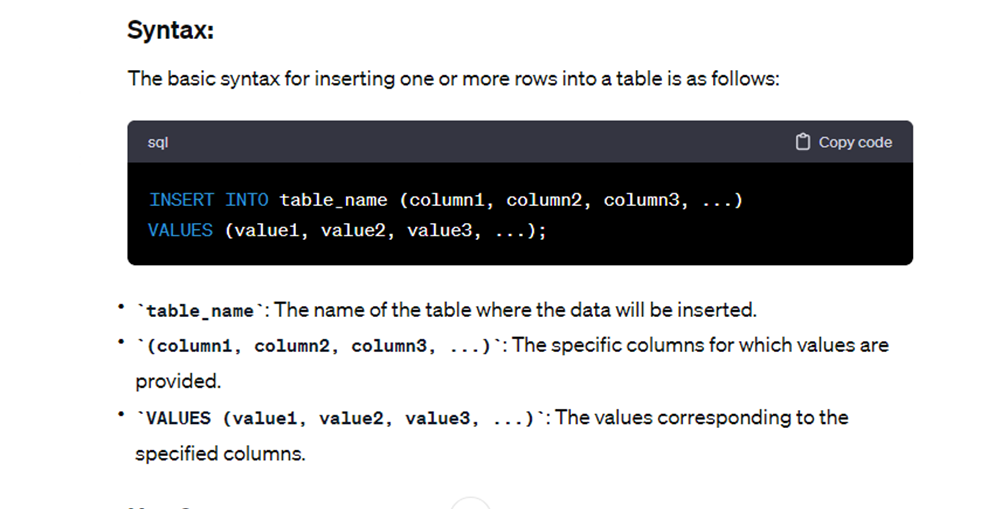

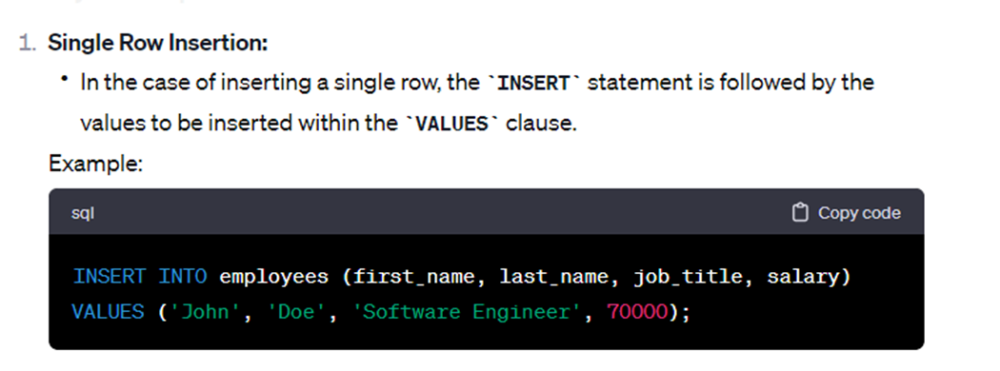

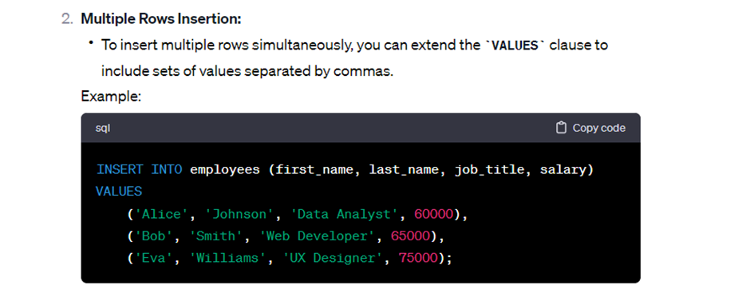

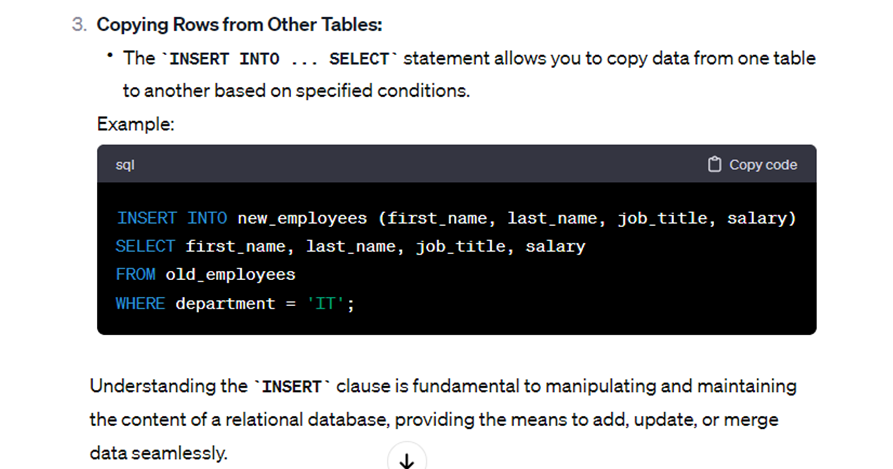

## Recap SQL UPDATE Clause:
The SQL UPDATE statement is used to modify existing records in a table. It allows you to change the values in one or more columns of a row or multiple rows based on a specified condition. The basic syntax of the UPDATE statement is as follows:

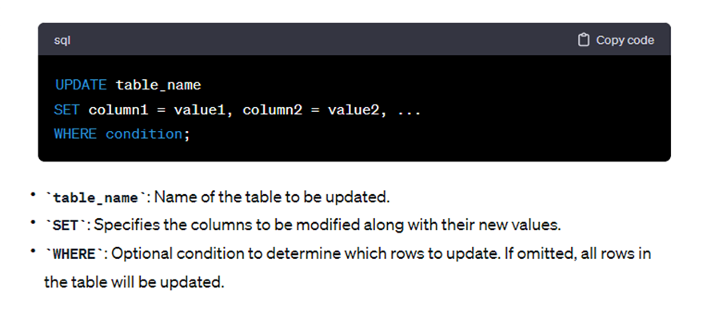

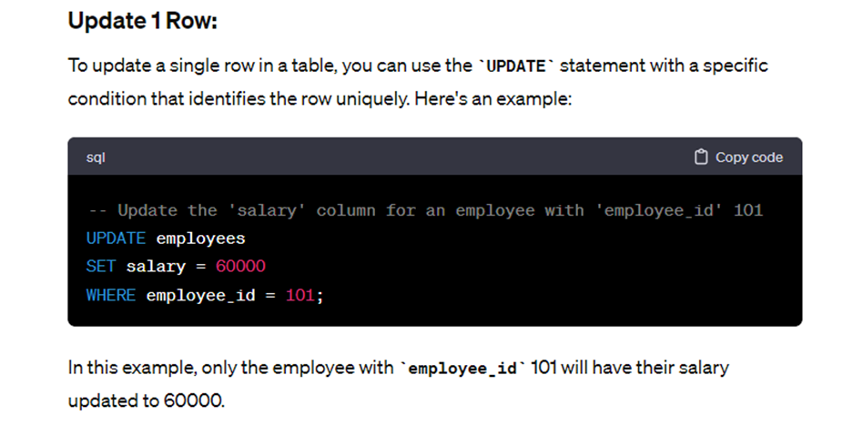

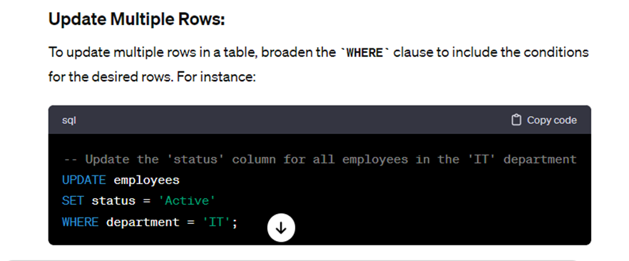

## Recap SQL DELETE:

The SQL DELETE statement is used to remove one or more records from a table in a database. It allows you to delete specific rows based on a condition or delete all rows if no condition is specified. The basic syntax of the DELETE statement is as follows:

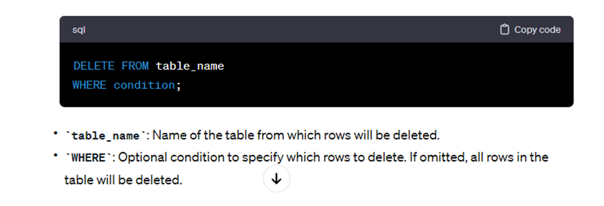

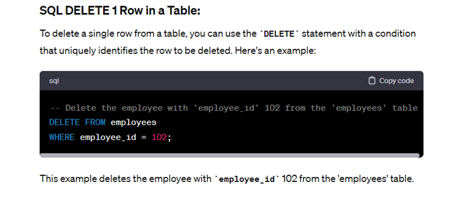

## SQL DELETE Multiple Rows in a Table:

To delete multiple rows from a table, broaden the WHERE clause to include the conditions for the desired rows. For instance:

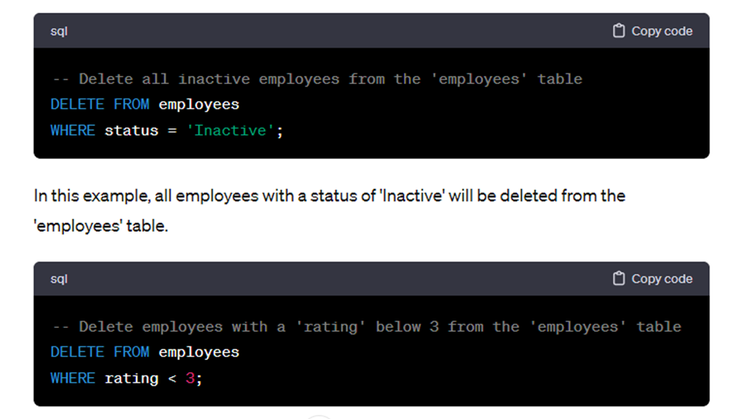

## SQL DELETE Rows from Related Tables:

When dealing with related tables (tables with foreign key relationships), deleting rows requires special consideration to maintain data integrity. If foreign key constraints are defined, you may need to delete rows from related tables first or handle the deletion through cascading actions.

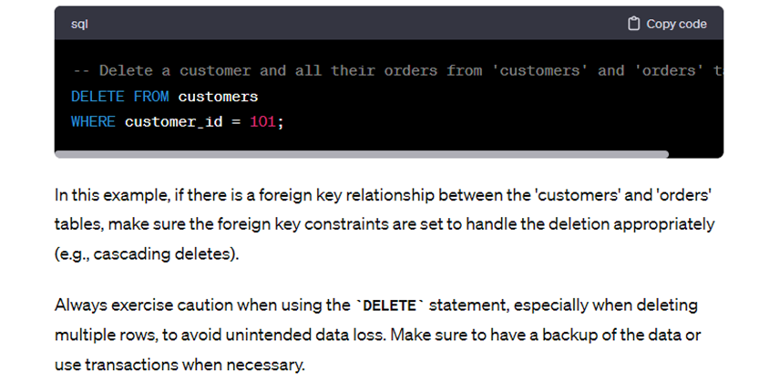

Industry Guest Week 8 Session Recordings:

Click [HERE](https://drive.google.com/drive/folders/1bgyW-TVdfS6r_EnBMaashFNgWLG17UQV?usp=sharing)