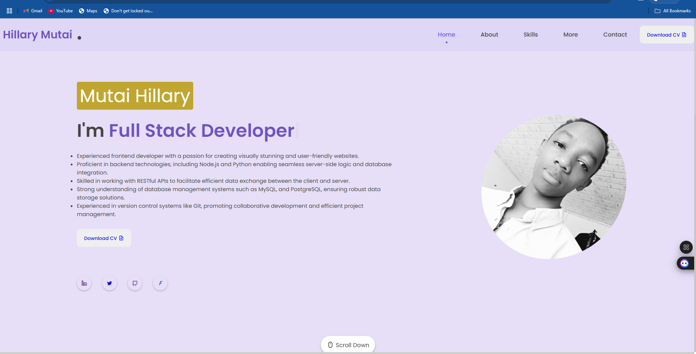
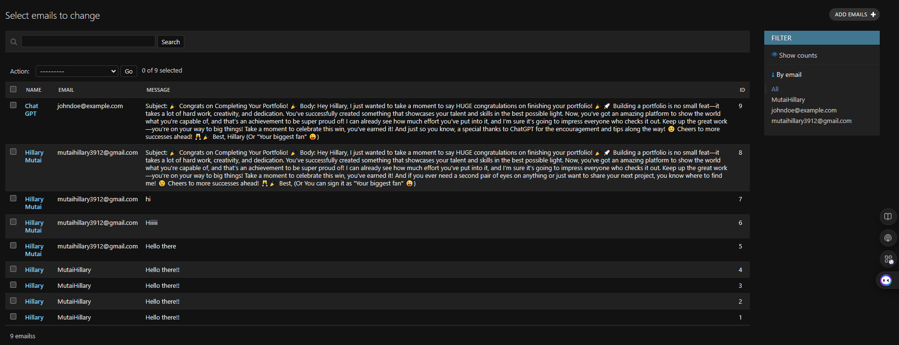
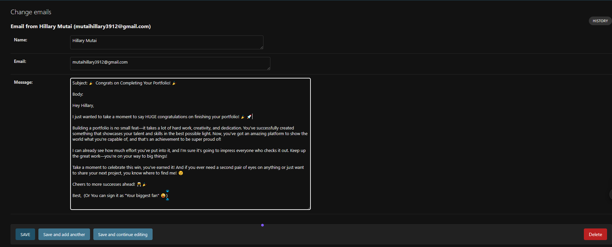
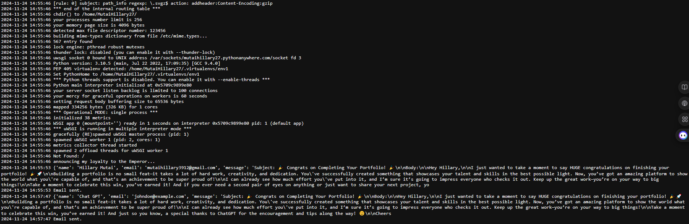

# Portfolio Project

You can quickly check out the site [here](https://machuge27.github.io/SWEngineering/)

## Table of Contents
- [Project Overview](#project-overview)
- [Features](#features)
- [Technologies Used](#technologies-used)
- [Setup Instructions](#setup-instructions)
- [Group Members](#group-members)
- [Project Images](#project-images)

---

## Project Overview
This is personal portfolio project designed to showcase individual and collaborative skills. The portfolio includes information about my personal information, my skills, the projects i've work on,and a way to contact me through email. Also i've got links to my socials please check them out and follow where applicable.

## Preview



---

## Features
- Responsive design
- Project showcase gallery
- Contact forms to reach me
- My current endeavors

---

## Technologies Used
- **Frontend:** HTML, JavaScript 
- **Styling:** CSS
- **Backend:** Django
- **Version Control:** Git & GitHub

---

## Setup Instructions
1. Clone the repository:
   ```bash
   git clone https://github.com/Machuge27/SWEngineering/tree/main/Hackathos/Portfolio
   ```
2. Navigate into the project directory:
   ```bash
   cd Portfolio
   ```
3. Open `index.html` in your browser to view the project.

## More info
This is the main github repository link, where the page is hosted, (Github pages):

```bash
   git@github.com:Machuge27/SWEngineering.git
```   
### _I had planed to use this repo to store all my coding practocals for this course, so i din't want to create a new repo! hence the trick:_

- I modified the static.yml file, changing the path to the directory containing my portfolio files thus github knows where to look:

```yml
- name: Upload artifact
        uses: actions/upload-pages-artifact@v3
        with:
          # Upload entire repository
          path: './Hackathos/Portfolio-Group-22'
```
---

## Group Members
1. **[Hillary Kiprotich](https://github.com/Machuge27/SWEngineering/tree/main/Hackathos/Portfolio)**
2. **[Hassan Khalifa](https://github.com/Faruq-Feroz/Hassan-Faruq)**
3. **[Saddam Saku](https://github.com/SaddamTechie/saddamtechie.github.io)**
4. **[Rashid said](https://github.com/SirRasheed/portfoliorasheed.git)**
5. **[Tom Obande](https://github.com/tbrowns/portfolio)**
6. **[Alexander Brian](https://github.com/BrianKachumba/HACKATHON.git)**
7. **[Zachariah Evans](https://github.com/Eva254-ke/myportfolio)**
7. **[Joshua Ogallo](https://github.com/ogallj/my_portfolio)**


---

## Project Images
### Admin site where all emails go instead of messing up your actual email because most of them might be spam or someone playing with you....


### You can read each email specifically the decide if to reply, or delete...


### And this is a sample pythonanywhere server log when a message is sent


---
