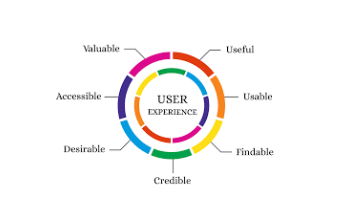
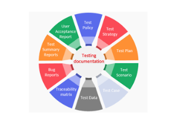

# 1. Types of Testing 🎉

Welcome to Week 2! In this lesson, we will explore the various types of software testing and their specific use cases. Understanding these types will help you choose the right testing approach for different scenarios in software development.

## Objectives 🎯

- Explore different types of software testing and their use cases.
- Understand the differences between functional and non-functional testing.

## Types of Testing Overview 🧪

Software testing can be broadly categorized into two main types: Functional Testing and Non-Functional Testing. Each category serves different purposes and is essential for ensuring software quality.

### Functional Testing 🔍

Functional testing focuses on verifying that the software functions according to specified requirements. It checks whether the application behaves as expected under various conditions. Here are the key types of functional testing:

| Type of Functional Testing | Description | Example |
|----------------------------|-------------|---------|
| Unit Testing               | Tests individual components or functions for correct behavior. | Checking if a function that calculates discounts works accurately. |
| Integration Testing        | Ensures that combined components work together correctly. | Verifying that different parts of an online shopping site communicate effectively during checkout. |
| System Testing             | Validates the complete system against specified requirements. | Testing an entire e-commerce platform to ensure all features work seamlessly together. |
| Acceptance Testing         | Conducted to determine if the software meets user needs and is ready for deployment. | End-users test an application to confirm it meets their requirements before launch. |

### Non-Functional Testing 🚀

Non-functional testing evaluates aspects of the software that do not relate directly to specific behaviors or functions. It focuses on performance, usability, security, and other quality attributes. Here are the key types of non-functional testing:

| Type of Non-Functional Testing | Description | Example |
|--------------------------------|-------------|---------|
| Performance Testing            | Assesses how the application performs under various conditions. | Load testing a website to see how it handles multiple users simultaneously. |
| Security Testing               | Identifies vulnerabilities and ensures data protection. | Conducting penetration tests to find security weaknesses in an application. |
| Usability Testing              | Evaluates how user-friendly and intuitive the application is. | Observing users as they navigate an app to identify areas for improvement. |
| Compatibility Testing          | Ensures that the software works across different devices, browsers, and operating systems. | Testing a web application on various browsers (Chrome, Firefox, Safari) to ensure consistent performance. |

## Manual vs. Automated Testing 🤖

Testing can also be categorized based on how it is executed: manually or automatically.

- **Manual Testing**: Testers execute test cases manually without using automation tools. This approach is often used for exploratory, usability, and ad-hoc testing.
- **Automated Testing**: Test scripts are written and executed using automation tools, allowing for faster execution of repetitive tests and greater coverage.

# Key Differences Between Manual and Automated Testing  

| **Aspect**         | **Manual Testing**                              | **Automated Testing**                           |
|--------------------|-----------------------------------------------|-----------------------------------------------|
| **Execution**      | Performed by human testers                    | Executed by automation tools                  |
| **Speed**         | Slower due to manual execution                 | Faster execution of repetitive tests         |
| **Cost-effectiveness** | More cost-effective for smaller projects or exploratory testing | More cost-effective for large projects with repetitive tests |
| **Flexibility**    | More adaptable to changes in requirements during testing phases | Requires maintenance of automation scripts when changes occur |

---

## Regression vs. Retesting 🔄  

Understanding **regression** and **retesting** is crucial in maintaining software quality:  

- **Regression Testing**: Conducted after changes (like bug fixes or new features) to ensure that existing functionality remains unaffected.  
- **Retesting**: Involves executing specific test cases that failed in previous tests after defects have been fixed, ensuring those specific issues are resolved.  

---

## Conclusion 🏁  

In this lesson, we've explored various types of **software testing**, including **functional and non-functional testing**, as well as **manual versus automated** approaches. Understanding these concepts will empower you to select appropriate testing strategies based on project requirements.  

### **Key Takeaways:**  
✅ **Functional testing** verifies that software behaves as expected.  
✅ **Non-functional testing** assesses quality attributes like performance and security.  
✅ Knowing **when to use manual or automated testing** is key to efficient test execution.  
✅ **Regression and retesting** are essential practices in maintaining software quality.  

As you continue your journey in software testing, keep these concepts in mind as they will form the foundation for more advanced topics! 🚀  

---

## Additional Resources 📚  

📺 **Video Title:** *5 Common Software Testing Types Explained in 7 Minutes*  
🔗 **Link:** [5 Common Software Testing Types Explained in 7 Minutes](https://www.youtube.com/watch?pp=ygUMI3Rlc3Rpbmd0eXBl&v=oRa6pRHeaXI&utm_source=chatgpt.com)  

📖 **Article:** *Best Practices in Functional vs Non-Functional Testing*  

🎥 **Pre-recorded Session:** Access our pre-recorded session on *"Types of Software Testing"* [here](#).  

# 2. Functional vs. Non-Functional Testing 🔍

Welcome to Lesson 2 of Week 2! In this session, we will delve deeper into the differences between functional and non-functional testing. Understanding these distinctions is crucial for selecting the right testing approach based on project requirements and ensuring software quality.

## Objectives 🎯
- Understand the differences between functional and non-functional testing.
- Explore the significance of each type in the software development lifecycle.

## What is Functional Testing? ✅

Functional testing is a type of software testing that verifies that each function of the software application operates in conformance with the required specification. It focuses on what the system does, ensuring that all functionalities work as intended.

### Key Characteristics of Functional Testing:
- **Requirement-Based**: Tests are derived from requirements and specifications.
- **User-Centric**: Focuses on user interactions and expected outcomes.
- **Black Box Testing**: Testers do not need to know the internal workings of the application.

### Types of Functional Testing:
| Type              | Description                                               | Example                                                                 |
|-------------------|-----------------------------------------------------------|-------------------------------------------------------------------------|
| Unit Testing      | Tests individual components or functions for correct behavior. | Checking if a function that calculates discounts works accurately.      |
| Integration Testing | Ensures that combined components work together correctly. | Verifying that different parts of an online shopping site communicate effectively during checkout. |
| System Testing    | Validates the complete system against specified requirements. | Testing an entire e-commerce platform to ensure all features work seamlessly together. |
| Acceptance Testing | Conducted to determine if the software meets user needs and is ready for deployment. | End-users test an application to confirm it meets their requirements before launch. |

## What is Non-Functional Testing? 🚀

Non-functional testing evaluates aspects of the software that do not relate directly to specific behaviors or functions. It focuses on how well the system performs under various conditions, including performance, usability, security, and compatibility.

### Key Characteristics of Non-Functional Testing:
- **Quality Attributes**: Assesses attributes such as performance, usability, reliability, etc.
- **Performance-Oriented**: Focuses on how well the system performs under load.
- **Various Techniques**: Involves different methods and tools for evaluation.

### Types of Non-Functional Testing:
| Type              | Description                                               | Example                                                                 |
|-------------------|-----------------------------------------------------------|-------------------------------------------------------------------------|
| Performance Testing | Assesses how the application performs under various conditions. | Load testing a website to see how it handles multiple users simultaneously. |
| Security Testing  | Identifies vulnerabilities and ensures data protection.   | Conducting penetration tests to find security weaknesses in an application. |
| Usability Testing | Evaluates how user-friendly and intuitive the application is. | Observing users as they navigate an app to identify areas for improvement. |
| Compatibility Testing | Ensures that the software works across different devices, browsers, and operating systems. | Testing a web application on various browsers (Chrome, Firefox, Safari) to ensure consistent performance. |

## Key Differences Between Functional and Non-Functional Testing 🔍
| Aspect           | Functional Testing                | Non-Functional Testing                |
|------------------|-----------------------------------|---------------------------------------|
| Focus            | What the system does              | How well the system performs          |
| Objective        | Validates functionality           | Evaluates quality attributes          |
| Test Cases       | Derived from functional requirements | Derived from non-functional requirements |
| Execution        | Typically executed first          | Performed after functional testing    |
| Examples         | Unit, integration, acceptance testing | Performance, security, usability testing |

## Conclusion 🏁

In this lesson, we explored the distinctions between functional and non-functional testing. Both types are essential for delivering high-quality software that meets user expectations.

In summary:
- Functional testing verifies that software behaves as expected based on requirements.
- Non-functional testing assesses quality attributes like performance and security.

By understanding these differences, you can select appropriate testing strategies based on your project's needs! 🚀

## Additional Resources 📚
- **Video Title**: Functional vs Non-Functional Testing. [Link: Functional vs Non-Functional Testing](https://www.youtube.com/watch?v=NRu3pHsgi-c)
- **Article**: Best Practices in Software Testing
- **Pre-recorded Session 🎥**: Access our pre-recorded session on "Functional vs. Non-Functional Testing" here: [Link to Session]

# 3. Manual vs. Automated Testing 🤖

Welcome to Lesson 3 of Week 2! In this session, we will explore the differences between manual testing and automated testing. Understanding these two approaches is essential for optimizing your testing processes and ensuring efficient software quality assurance.

## Objectives 🎯
- Understand the key differences between manual and automated testing.
- Recognize the advantages and disadvantages of each approach.

## What is Manual Testing? 📝

Manual testing is the process of manually executing test cases without the use of automation tools. Testers perform test scenarios as end-users would, checking for defects and ensuring that the software behaves as expected.

### Key Characteristics of Manual Testing:
- **Human Interaction:** Testers execute test cases manually, simulating user behavior.
- **Exploratory Nature:** Allows testers to explore the application and identify issues that may not be covered by predefined test cases.
- **Flexible:** Easily adapts to changes in requirements or application features.

### Advantages of Manual Testing:
| Advantage | Description |
|-----------|-------------|
| Flexibility | Testers can quickly adapt to changes in requirements or functionality. |
| Exploratory Testing | Testers can discover unexpected issues through exploration. |
| Cost-effective for Small Projects | Ideal for smaller projects where automation may not be justified. |

### Disadvantages of Manual Testing:
| Disadvantage | Description |
|--------------|-------------|
| Time-consuming | Manual execution of tests can be slow, especially for large applications. |
| Human Error | Prone to mistakes due to fatigue or oversight. |
| Limited Reusability | Test cases need to be executed from scratch each time, making it less efficient for regression testing. |

## What is Automated Testing? 🤖

Automated testing involves using specialized tools and scripts to execute test cases automatically. This approach allows for faster execution of tests, especially for repetitive tasks.

### Key Characteristics of Automated Testing:
- **Tool-Driven:** Utilizes automation tools to run tests without human intervention.
- **Scripted Tests:** Test cases are written in advance and executed by the automation framework.
- **Consistent Execution:** Ensures that tests are executed in a consistent manner every time.

### Advantages of Automated Testing:
| Advantage | Description |
|-----------|-------------|
| Speed | Tests can be executed much faster compared to manual testing. |
| Reusability | Automated tests can be reused across different versions of the application. |
| Increased Coverage | Allows for more extensive testing across various scenarios and configurations. |

### Disadvantages of Automated Testing:
| Disadvantage | Description |
|--------------|-------------|
| Initial Setup Cost | Requires investment in tools and time for script development. |
| Maintenance Overhead | Automation scripts need regular updates as application features change. |
| Limited Exploratory Testing | Less effective at identifying unexpected issues compared to manual testing. |

# Key Differences Between Manual and Automated Testing  

| **Aspect**         | **Manual Testing**                              | **Automated Testing**                           |
|--------------------|-----------------------------------------------|-----------------------------------------------|
| **Execution**      | Performed by human testers                    | Executed by automation tools                  |
| **Speed**         | Slower due to manual execution                 | Faster execution of repetitive tests         |
| **Cost-effectiveness** | More cost-effective for smaller projects or exploratory testing | More cost-effective for large projects with repetitive tests |
| **Flexibility**    | More adaptable to changes in requirements during testing phases | Requires maintenance of automation scripts when changes occur |

---

## Regression vs. Retesting 🔄  

Understanding **regression** and **retesting** is crucial in maintaining software quality:  

- **Regression Testing**: Conducted after changes (like bug fixes or new features) to ensure that existing functionality remains unaffected.  
- **Retesting**: Involves executing specific test cases that failed in previous tests after defects have been fixed, ensuring those specific issues are resolved.  

---

## Conclusion 🏁  

In this lesson, we've explored various types of **software testing**, including **functional and non-functional testing**, as well as **manual versus automated** approaches. Understanding these concepts will empower you to select appropriate testing strategies based on project requirements.  

### **Key Takeaways:**  
✅ **Functional testing** verifies that software behaves as expected.  
✅ **Non-functional testing** assesses quality attributes like performance and security.  
✅ Knowing **when to use manual or automated testing** is key to efficient test execution.  
✅ **Regression and retesting** are essential practices in maintaining software quality.  

As you continue your journey in software testing, keep these concepts in mind as they will form the foundation for more advanced topics! 🚀  

---

## Additional Resources 📚  

📺 **Video Title:** *5 Common Software Testing Types Explained in 7 Minutes*  
🔗 **Link:** [5 Common Software Testing Types Explained in 7 Minutes](#)  

📖 **Article:** *Best Practices in Functional vs Non-Functional Testing*  

🎥 **Pre-recorded Session:** Access our pre-recorded session on *"Types of Software Testing"* [here](#).  

# 4. Regression Testing and Retesting 🔄

Welcome to Lesson 4 of Week 2! In this session, we will explore regression testing and retesting, two crucial concepts in the software testing lifecycle. Understanding these processes is essential for maintaining software quality after changes have been made.

## Objectives 🎯
- Understand the concepts of regression testing and retesting.
- Recognize the importance of each in ensuring software reliability.

## What is Regression Testing? 🔄

Regression testing is a type of software testing that ensures that recent changes or enhancements to the code do not adversely affect existing functionality. It involves re-running previously completed tests to confirm that the application still performs as expected after modifications.

### Key Characteristics of Regression Testing:
- **Broad Coverage**: Tests a wide range of functionalities to ensure that no existing features are broken.
- **Automation Friendly**: Often automated due to the repetitive nature of the tests, making it efficient for large applications.
- **Performed After Changes**: Conducted after any code changes, such as bug fixes, enhancements, or new feature additions.

### Importance of Regression Testing:
- **Ensures Stability**: Confirms that existing functionality remains intact after changes.
- **Identifies Side Effects**: Detects any unintended consequences of code modifications.
- **Build Confidence**: Provides assurance to stakeholders that the software continues to meet quality standards.

## What is Retesting? ✔️

Retesting is the process of executing specific test cases that previously failed after defects have been fixed. The goal is to verify that the identified issues have been resolved and that the application now behaves as expected.

### Key Characteristics of Retesting:
- **Focused Approach**: Targets specific defects rather than broad functionality.
- **Same Test Cases**: The same test cases are executed again to confirm defect resolution.
- **Performed After Fixes**: Conducted immediately after developers address reported issues.

### Importance of Retesting:
- **Validates Fixes**: Ensures that reported defects have been successfully resolved.
- **Prevents Recurrence**: Helps confirm that fixes do not introduce new issues.
- **Enhances Quality Assurance**: Contributes to overall software quality by ensuring defect resolution.

## Key Differences Between Regression Testing and Retesting 🔍

| Aspect       | Regression Testing                              | Retesting                                      |
|--------------|-------------------------------------------------|------------------------------------------------|
| Purpose      | Ensures existing functionality remains intact after changes | Verifies specific defects have been fixed      |
| Scope        | Broad coverage across multiple functionalities  | Focused on specific test cases related to defects |
| Test Cases   | Re-execution of previously passed test cases    | Re-execution of previously failed test cases   |
| Timing       | Conducted after any code changes                | Conducted after defect fixes                   |

## Conclusion 🏁

In this lesson, we explored the concepts of regression testing and retesting, highlighting their importance in maintaining software quality. Both processes play vital roles in ensuring that software remains reliable even as changes are made.

In summary:
- **Regression Testing** ensures that existing functionalities are not affected by recent changes.
- **Retesting** verifies that specific defects have been resolved.

By effectively implementing both regression testing and retesting, you can significantly enhance the reliability and quality of your software! 🚀

## Additional Resources 📚

- **Video Title**: Difference between Retesting and Regression Testing. [Link](https://www.youtube.com/watch?v=z_L7XjVCFp4)
- **Article**: Best Practices for Effective Regression Testing
- **Pre-recorded Session 🎥**: Access our pre-recorded session on "Regression Testing and Retesting" here: [Link to Session]

## 5. Testing Tools and Frameworks 🛠️

### Introduction to Testing Tools and Frameworks 🛠️

Welcome to Lesson 5 of Week 2! In this session, we will explore various testing tools and frameworks that can enhance your testing processes. Understanding these tools is essential for improving efficiency and effectiveness in software testing.

### Objectives 🎯
- Identify different types of testing tools and their purposes.
- Understand the role of testing frameworks in automating and organizing tests.

### Types of Testing Tools 🧰

Testing tools can be categorized based on their functionalities. Here are some common types of testing tools:

| Type of Tool             | Description                                         | Examples                        |
|--------------------------|-----------------------------------------------------|---------------------------------|
| Test Management Tools    | Help manage test cases, test execution, and reporting. | JIRA, TestRail, Zephyr          |
| Automated Testing Tools  | Facilitate automated execution of test cases.       | Selenium, JUnit, TestNG         |
| Performance Testing Tools| Assess application performance under various load conditions. | JMeter, LoadRunner, Gatling     |
| Security Testing Tools   | Identify vulnerabilities and security flaws in applications. | OWASP ZAP, Burp Suite, Nessus   |
| Static Analysis Tools    | Analyze code for potential issues without execution. | SonarQube, ESLint, Checkstyle   |

### Role of Testing Frameworks 📚

Testing frameworks provide a structured approach to writing and executing tests. They define guidelines for creating test cases and often include libraries that facilitate test automation.

**Key Characteristics of Testing Frameworks:**
- **Organization:** Help organize test cases in a systematic manner.
- **Reusability:** Promote the reuse of test scripts and components.
- **Integration:** Often integrate with other tools for reporting and continuous integration.

**Common Testing Frameworks:**

| Framework | Description | Use Case |
|-----------|-------------|----------|
| JUnit     | A widely-used framework for unit testing in Java applications. | Unit testing for Java applications. |
| TestNG    | A flexible framework inspired by JUnit that supports parallel execution. | Integration and functional testing in Java. |
| Selenium  | An open-source framework for automating web applications. | Automated functional testing for web apps. |
| Cucumber  | Supports behavior-driven development (BDD) with a focus on collaboration. | Writing tests in a human-readable format for better collaboration between teams. |

### Benefits of Using Testing Tools and Frameworks 🌟
- **Increased Efficiency:** Automating repetitive tasks saves time and resources.
- **Improved Accuracy:** Reduces human error in test execution.
- **Better Collaboration:** Tools facilitate communication among team members.
- **Comprehensive Reporting:** Most tools provide detailed reports on test results, helping teams track progress.

### Conclusion 🏁

In this lesson, we explored various types of testing tools and frameworks that can enhance your software testing efforts. By leveraging these resources, you can improve the efficiency and effectiveness of your testing processes.

**In summary:**
- There are several categories of testing tools, each serving specific purposes.
- Testing frameworks help organize and automate tests, promoting best practices in software quality assurance.

As you continue your journey in software testing, consider exploring these tools to optimize your processes! 🚀

### Additional Resources 📚
- **Video Title:** Open Source Tools for Test Automation in 2023. [Open Source Tools for Test Automation in 2023](https://www.youtube.com/watch?v=vVrNlKLcFNc)
- **Article:** Choosing the Right Testing Framework
- **Pre-recorded Session 🎥:** Access our pre-recorded session on "Introduction to Testing Tools and Frameworks" here: Link to Session

## 6. Best Practices in Software Testing 🌟

Welcome to Lesson 6 of Week 2! In this session, we will discuss some best practices in software testing that can help improve the efficiency and effectiveness of your testing processes. By implementing these practices, you can enhance the overall quality of your software products.

### Objectives 🎯
- Identify key best practices in software testing.
- Understand how to apply these practices in real-world scenarios.

### Best Practices in Software Testing 🛠️

#### Early Testing
Start testing activities as early as possible in the software development lifecycle (SDLC). Early testing helps identify defects before they propagate further into the development process, reducing costs and effort associated with fixing them later.

#### Test Planning
Develop a comprehensive test plan that outlines the scope, objectives, resources, schedule, and approach for testing. A well-defined test plan serves as a roadmap for the testing process and ensures all team members are aligned.

#### Prioritize Testing Based on Risk
Focus on high-risk areas of the application where defects are more likely to occur or where failures could have significant consequences. Prioritizing testing efforts helps allocate resources effectively and improves overall quality.

#### Use of Automation
Leverage automated testing tools for repetitive and time-consuming tasks. Automation can significantly speed up the testing process, especially for regression and performance testing, while also increasing test coverage.

#### Maintain Test Cases
Regularly review and update test cases to ensure they remain relevant and effective. This practice helps address changes in requirements or application features and ensures that tests continue to provide value.

#### Incorporate Continuous Testing
Integrate testing into the continuous integration/continuous deployment (CI/CD) pipeline. Continuous testing allows for immediate feedback on code changes, enabling teams to identify issues early and maintain high-quality standards throughout development.

#### Encourage Collaboration
Foster collaboration between testers, developers, and stakeholders throughout the development process. Open communication helps ensure that everyone is aligned on requirements, expectations, and potential risks.

#### Conduct Regular Reviews
Implement regular reviews of test plans, test cases, and results to identify areas for improvement. Learning from past experiences can help refine testing strategies and enhance overall quality assurance practices.

#### Focus on User Experience

Always keep the end-user in mind during testing. Conduct usability testing to ensure that the application meets user needs and provides a positive experience.

#### Document Everything

Maintain thorough documentation of test cases, results, defects, and lessons learned throughout the testing process. Documentation serves as a valuable resource for future projects and helps improve team knowledge.

### Conclusion 🏁
In this lesson, we explored key best practices in software testing that can enhance your testing efforts and contribute to higher-quality software products. By implementing these practices, you can improve efficiency, reduce risks, and ensure that your applications meet user expectations.

In summary:
- Start testing early in the SDLC to catch defects sooner.
- Develop comprehensive test plans and prioritize based on risk.
- Leverage automation for efficiency while maintaining collaboration among team members.

By following these best practices, you will be well-equipped to navigate the complexities of software testing effectively! 🚀

### Additional Resources 📚
- **Video Title:** [Software Testing Best Practices](https://www.youtube.com/watch?v=VSGICOjSJUQ)
- **Article:** Effective Test Planning Strategies

### Pre-recorded Session 🎥
Access our pre-recorded session on "Best Practices in Software Testing" here: [Link to Session]

