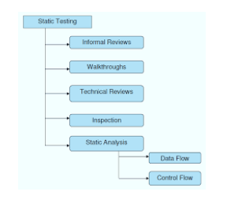

# 1. Static Testing
## Overview of Static Testing Techniques 📋

[Repo](https://github.com/PLP-Database-Design/week-3-assignment-Machuge27.git)

Welcome to Week 3! In this lesson, we will explore static testing techniques, which are essential for early defect detection in software development. Understanding these techniques can significantly improve software quality by identifying issues before they become more costly to fix.

## Objectives 🎯
- Understand the benefits of static testing in early defect detection.
- Learn and apply review techniques such as walkthroughs, technical reviews, and inspections.

## What is Static Testing? 📝

Static testing involves reviewing and analyzing software artifacts (such as code, requirements, and design documents) without executing the program. This approach helps identify defects early in the development process, making it a cost-effective strategy for improving software quality.

### Benefits of Static Testing:
- **Early Defect Detection:** Identifying issues before execution reduces the cost and effort required for fixes.
- **Improves Quality:** Ensures that the software meets specified requirements and standards.
- **Enhances Documentation:** Reviews help ensure that documentation aligns with the actual implementation.

## Static Testing Techniques 🔍

Let’s explore some common static testing techniques:

### Walkthroughs

A walkthrough is an informal review process where developers present their work to peers. The goal is to gather feedback and identify potential issues early. During a walkthrough, participants discuss the material, ask questions, and provide insights.

**Key Points:**
- Collaborative approach involving team members.
- Focuses on understanding the work rather than formal defect identification.

### Technical Reviews

Technical reviews are more formal than walkthroughs and involve a structured examination of software artifacts by a group of qualified individuals. The objective is to evaluate the quality of the work and identify defects or areas for improvement.

**Key Points:**
- Conducted by peers or experts in the relevant domain.
- Focuses on identifying defects against predefined criteria.

### Inspections

Inspections are formal review processes that follow a defined procedure. They involve a thorough examination of documents or code by a team with specific roles (e.g., moderator, author, reviewers). Inspections aim to identify defects systematically.

**Key Points:**
- Highly structured process with defined roles and responsibilities.
- Emphasizes defect detection through detailed examination.

## Static Analysis Tools 🛠️

Static analysis tools automate the process of reviewing code for potential issues without executing it. These tools can identify coding standards violations, security vulnerabilities, and other defects early in the development cycle.

### Applications of Static Analysis Tools:
- **Code Quality Assurance:** Enforces coding standards and best practices.
- **Security Vulnerability Detection:** Identifies potential security flaws before deployment.
- **Performance Optimization:** Highlights areas in code that may lead to performance issues.

### Examples of Static Analysis Tools:
- **SonarQube:** An open-source platform that continuously inspects code quality.
- **ESLint:** A tool for identifying and reporting on patterns found in JavaScript code.
- **Checkstyle:** A development tool to help programmers write Java code that adheres to a coding standard.

## Identifying Defects in Requirements and Design Documents 📄

Static testing techniques can also be applied to requirements and design documents to uncover defects early in the development process. Common issues include:

- **Ambiguities:** Unclear or vague requirements can lead to misunderstandings during implementation.
- **Inconsistencies:** Conflicting requirements may arise from different stakeholders or sources.
- **Missing Requirements:** Essential functionality may be overlooked if not clearly documented.

By reviewing these documents using static testing techniques, teams can ensure that all requirements are clear, complete, and aligned with user needs before moving into development.

## Conclusion 🏁

In this lesson, we explored static testing techniques such as walkthroughs, technical reviews, and inspections. We also discussed the importance of static analysis tools in identifying defects early in the software development lifecycle.

### In summary:
- Static testing helps detect defects before execution, improving overall quality.
- Various review techniques facilitate collaborative defect identification.
- Static analysis tools enhance code quality assurance by automating defect detection.

By applying these static testing techniques effectively, you can significantly enhance the reliability of your software products! 🚀

## Additional Resources 📚
- **Video Title:** What is Static Testing? [Link: What is Static Testing?](https://www.youtube.com/watch?v=IJSppVpxCE4)
- **Article:** Best Practices for Conducting Effective Reviews
- **Pre-recorded Session 🎥:** Access our pre-recorded session on "Overview of Static Testing Techniques" here: [Link to Session]

# 2. Techniques in Static Testing 📋

## Review Techniques in Static Testing 📋

Welcome to Lesson 2 of Week 3! In this session, we will focus on various review techniques used in static testing. These techniques are essential for identifying defects early in the software development process, ensuring higher quality and reliability of the final product.

### Objectives 🎯
- Learn and apply review techniques such as walkthroughs, technical reviews, and inspections.
- Understand the importance of each technique in the context of static testing.

### Overview of Review Techniques in Static Testing 🔍

Review techniques are structured processes that involve examining software artifacts (such as code, requirements, and design documents) to identify defects before execution. These techniques promote collaboration among team members and facilitate early detection of issues.

#### 1. Walkthroughs 📝

A walkthrough is an informal review process where a developer presents their work to peers. The primary goal is to gather feedback and identify potential issues early.

**Key Characteristics:**
- **Informal Setting:** Typically conducted in a relaxed atmosphere.
- **Collaborative Feedback:** Team members provide insights and suggestions.
- **Focus on Understanding:** Aims to ensure that everyone understands the material being reviewed.

**When to Use:**
- During the early stages of development when concepts are being introduced.
- For gathering initial feedback on new features or designs.

#### 2. Technical Reviews 🔧

Technical reviews are more formal than walkthroughs and involve a structured examination of software artifacts by a group of qualified individuals. The objective is to evaluate the quality of the work and identify defects or areas for improvement.

**Key Characteristics:**
- **Structured Process:** Follows a defined agenda and guidelines.
- **Qualified Participants:** Involves peers or experts with relevant knowledge.
- **Focus on Quality Assessment:** Aims to identify defects against predefined criteria.

**When to Use:**
- When detailed evaluation of design documents or code is necessary.
- For assessing compliance with standards and best practices.

#### 3. Inspections 🔍

Inspections are formal review processes that follow a defined procedure. They involve a thorough examination of documents or code by a team with specific roles (e.g., moderator, author, reviewers). Inspections aim to identify defects systematically.

**Key Characteristics:**
- **Highly Structured:** Includes defined roles and responsibilities for participants.
- **Emphasis on Defect Detection:** Focuses on finding issues rather than providing feedback.
- **Documentation of Findings:** All identified defects are documented for resolution.

**When to Use:**
- For critical documents or code that require thorough examination.
- When compliance with regulatory standards is necessary.

### Importance of Review Techniques 🌟

Implementing these review techniques in static testing offers several benefits:
- **Early Defect Detection:** Identifying issues before execution reduces costs associated with fixing defects later in the process.
- **Improved Quality Assurance:** Systematic reviews enhance overall software quality by ensuring that requirements are met.
- **Enhanced Collaboration:** Encourages teamwork and knowledge sharing among team members, leading to better outcomes.

### Conclusion 🏁

In this lesson, we explored various review techniques used in static testing, including walkthroughs, technical reviews, and inspections. Each technique plays a vital role in identifying defects early and improving software quality.

**In summary:**
- Walkthroughs promote informal feedback and understanding.
- Technical reviews provide structured quality assessments.
- Inspections ensure thorough defect detection through formal processes.

By applying these review techniques effectively, you can significantly enhance the reliability of your software products! 🚀

### Additional Resources 📚
- **Video Title:** [ISTQB Foundation Level #23 - Types of Review | Walkthroughs, Technical Reviews, Inspections](https://www.youtube.com/watch?v=XOr2f4sluJo)
- **Article:** [Best Practices for Conducting Walkthroughs and Inspections](#)
- **Pre-recorded Session 🎥:** Access our pre-recorded session on "Review Techniques in Static Testing" here: [Link to Session](#)

# 3. Static Analysis Tools 🔧

## Static Analysis Tools and Their Applications 🔧

Welcome to Lesson 3 of Week 3! In this session, we will focus on static analysis tools and their applications in the software development process. These tools play a crucial role in enhancing code quality and identifying defects early, making them an essential part of static testing.

### Objectives 🎯

- Understand the purpose and benefits of static analysis tools.
- Explore various static analysis tools and their applications in software testing.

### What are Static Analysis Tools? 🛠️

Static analysis tools are software applications that analyze code without executing it. They help developers identify potential issues, enforce coding standards, and ensure compliance with best practices. By integrating these tools into the development process, teams can catch defects early and improve overall code quality.

### Key Benefits of Static Analysis Tools:

- **Early Detection of Defects:** Identify issues before they become more complex or costly to fix.
- **Improved Code Quality:** Enforce coding standards and best practices, leading to cleaner code.
- **Enhanced Security:** Detect security vulnerabilities early in the development cycle.
- **Increased Productivity:** Automate routine checks, allowing developers to focus on more complex tasks.

### Common Static Analysis Tools 🛠️

| Tool Name   | Description                                                                 | Use Case                                                |
|-------------|-----------------------------------------------------------------------------|---------------------------------------------------------|
| SonarQube   | An open-source platform for continuous inspection of code quality.          | Monitors code quality and provides detailed reports on issues. |
| ESLint      | A tool for identifying and reporting on patterns found in JavaScript code.  | Ensures adherence to coding standards in JavaScript projects. |
| Checkstyle  | A development tool that helps programmers write Java code that adheres to a coding standard. | Enforces coding conventions in Java applications.       |
| FindBugs    | An open-source static analysis tool that looks for bugs in Java programs.   | Identifies potential bugs and vulnerabilities in Java code. |
| PMD         | A source code analyzer that detects common programming flaws like unused variables and empty catch blocks. | Helps maintain clean code by identifying unnecessary or problematic constructs. |

### Applications of Static Analysis Tools 🌟

Static analysis tools can be applied across various stages of the software development lifecycle:

- **Code Reviews:** Integrating static analysis into the code review process helps identify issues before merging changes into the main branch.
- **Continuous Integration (CI):** Incorporating static analysis tools into CI pipelines ensures that code quality checks are automated with every build, catching issues early.
- **Security Audits:** Static analysis tools can scan code for known security vulnerabilities, helping teams address potential risks before deployment.
- **Compliance Checks:** Many industries have coding standards and regulations; static analysis tools can help ensure compliance with these requirements.

### Conclusion 🏁

In this lesson, we explored the importance of static analysis tools in enhancing software quality through early defect detection and adherence to coding standards. By integrating these tools into the development process, teams can significantly improve their overall testing efforts.

**In summary:**

- Static analysis tools provide valuable insights into code quality without executing it.
- They help identify defects early, enforce standards, and enhance security.
- Common tools like SonarQube, ESLint, and Checkstyle serve various purposes within the development lifecycle.

By leveraging static analysis tools effectively, you can contribute to producing high-quality software products! 🚀

### Additional Resources 📚

- **Video Title:** What Are Static Analysis Tools? 
- **Link:** [What Are Static Analysis Tools?](https://www.youtube.com/watch?v=d_BCGvXbpKs)
- **Article:** Best Practices for Using Static Analysis Tools

### Pre-recorded Session 🎥

Access our pre-recorded session on "Static Analysis Tools and Their Applications" here: [Link to Session](#)
# 4. Defects in Requirements and Design Documents 📝

Welcome to Lesson 4 of Week 3! In this session, we will focus on the importance of identifying defects in requirements and design documents through static testing techniques. Early detection of issues in these documents can significantly enhance the quality of the final product.

## Objectives 🎯
- Understand the significance of reviewing requirements and design documents.
- Learn techniques for identifying defects in these documents.

## Importance of Requirements and Design Reviews 📄

Requirements and design documents serve as the foundation for software development. Defects in these documents can lead to misunderstandings, implementation errors, and ultimately, software that does not meet user needs. By identifying issues early, teams can avoid costly rework later in the development process.

### Common Defects Found in Requirements and Design Documents:
- **Ambiguities**: Vague or unclear requirements can lead to different interpretations by developers.
- **Inconsistencies**: Conflicting information across documents can create confusion during implementation.
- **Missing Requirements**: Essential features may be overlooked if not clearly documented.
- **Unrealistic Requirements**: Requirements that are not feasible within project constraints can lead to project failure.

## Techniques for Identifying Defects 🛠️

### Requirements Review

Conducting a thorough review of requirements involves examining them for clarity, completeness, and testability. This process often includes:
- **Peer Reviews**: Involving team members to provide feedback on requirements.
- **Checklists**: Using predefined criteria to ensure all aspects of requirements are covered.

### Design Document Review

Reviewing design documents focuses on evaluating architectural decisions, data flow, and system interactions. Key activities include:
- **Technical Reviews**: Assessing design choices against best practices and standards.
- **Walkthroughs**: Presenting design documents to stakeholders for feedback and clarification.

### Static Analysis Tools

Utilizing static analysis tools can help identify issues in requirements and design documents by checking for compliance with standards and detecting inconsistencies. Examples include:
- Tools that validate requirement formats.
- Tools that check design diagrams for adherence to modeling standards.

## Benefits of Early Detection of Defects 🌟

Identifying defects in requirements and design documents offers several advantages:
- **Cost Savings**: Fixing issues early is significantly less expensive than addressing them during later development stages.
- **Improved Communication**: Clear documentation fosters better understanding among team members and stakeholders.
- **Higher Quality Software**: Ensures that the final product aligns with user needs and expectations.

## Conclusion 🏁

In this lesson, we explored the importance of identifying defects in requirements and design documents through static testing techniques. By implementing effective review processes and utilizing tools, teams can significantly enhance software quality from the outset.

In summary:
- Early detection of defects in documentation prevents costly rework.
- Techniques such as peer reviews, technical reviews, and static analysis tools are essential for identifying issues.
- Clear and complete documentation is crucial for successful software development.

By prioritizing the review of requirements and design documents, you contribute to delivering high-quality software products! 🚀

## Additional Resources 📚
- **Video Title**: Best Practices for Reviewing Requirements.
    - **Link**: [Best Practices for Reviewing Requirements](https://www.youtube.com/watch?v=Q0yUJYdVFl0)
- **Article**: Techniques for Effective Design Reviews
- **Pre-recorded Session** 🎥: Access our pre-recorded session on "Identifying Defects in Requirements and Design Documents" here: [Link to Session](#)

# 5. Additional content

Which of these is a popular static analysis tool?

**C. c) SonarQube**

### Explanation:
- **JUnit**: A testing framework for Java (not a static analysis tool).
- **Selenium**: A testing tool for web applications (not a static analysis tool).
- **SonarQube**: A popular tool for continuous inspection of code quality, including static analysis.
- **LoadRunner**: A performance testing tool (not a static analysis tool). 

