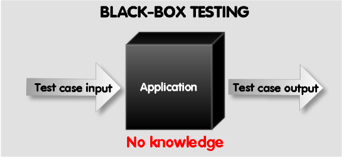
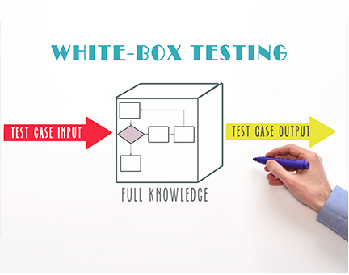

# 1. Black-Box Test 🎯

## Black-Box Test Design Techniques 🎯

[Repo](https://github.com/PLP-Database-Design/week-4-assignment-Machuge27.git)

Welcome to Week 4! In this lesson, we will focus on black-box test design techniques. These techniques are essential for creating effective and efficient test cases by examining the functionality of the software without peering into its internal structures or workings.

### Objectives 🎯
- Learn and apply black-box test design techniques.
- Create effective and efficient test cases.

## What is Black-Box Testing? 🖥️

Black-box testing is a testing technique that evaluates the functionality of an application without any knowledge of its internal code structure. Testers focus on inputs and expected outputs, ensuring that the software meets user requirements and behaves as intended.

### Key Characteristics of Black-Box Testing:
- **User-Centric**: Tests are based on user requirements and specifications.
- **No Knowledge of Internal Code**: Testers do not need to understand how the system is implemented.
- **Focus on Functionality**: Emphasizes what the system does rather than how it does it.

## Black-Box Test Design Techniques 🛠️

### Equivalence Partitioning

This technique divides input data into valid and invalid partitions (or classes) to reduce the number of test cases while maintaining coverage. Each partition should ideally produce the same result.

**Example**: If a function accepts age as input (valid range: 18-65), you can create partitions like:
- Valid: 18, 30, 65
- Invalid: 17, 66, -1

### Boundary Value Analysis

This technique focuses on testing at the boundaries between partitions. It is based on the idea that errors often occur at the edges of input ranges.

**Example**: For an age input function with a valid range of 18 to 65:
- Test values: 17 (invalid), 18 (valid), 65 (valid), 66 (invalid)

### Decision Tables

Decision tables are used when dealing with complex business rules. They provide a structured way to represent combinations of inputs and their corresponding outputs.

**Example**: For a discount application based on membership status and purchase amount:

| Membership Status | Purchase Amount | Discount |
|-------------------|-----------------|----------|
| Gold              | > $100          | 20%      |
| Gold              | ≤ $100          | 10%      |
| Silver            | > $100          | 15%      |
| Silver            | ≤ $100          | 5%       |

### State Transition Testing

This technique is used to test systems that have different states and transitions between those states. It ensures that the system behaves correctly during state changes.

**Example**: For a user login system:
- States: Logged Out, Logged In
- Transitions: Enter Credentials (Logged Out → Logged In), Logout (Logged In → Logged Out)

## Creating Effective Test Cases 📝

When designing test cases using black-box techniques, consider the following best practices:
- **Clear Objectives**: Each test case should have a clear purpose and expected outcome.
- **Comprehensive Coverage**: Ensure that all functional requirements are covered by your test cases.
- **Simplicity**: Keep test cases simple and easy to understand for anyone reviewing them.
- **Traceability**: Link test cases back to specific requirements to ensure coverage.

## Conclusion 🏁

In this lesson, we explored black-box test design techniques such as equivalence partitioning, boundary value analysis, decision tables, and state transition testing. These techniques are vital for creating effective test cases that ensure software functionality meets user expectations.

### In summary:
- Black-box testing focuses on inputs and outputs without knowledge of internal workings.
- Various techniques help streamline test case creation while maintaining effectiveness.

By applying these black-box testing techniques, you can enhance your testing strategies and contribute to delivering high-quality software products! 🚀

## Additional Resources 📚
- **Video Title**: "Black Box Testing | Software Testing". [Link](https://www.youtube.com/watch?v=9sVcvyCaCU8)
- **Article**: Best Practices for Test Case Design
- **Pre-recorded Session 🎥**: Access our pre-recorded session on "Black-Box Test Design Techniques" here: [Link to Session]

# 2. White-Box Test 🔍

## White-Box Test Design Techniques 🔍

Welcome to Lesson 2 of Week 4! In this session, we will focus on white-box test design techniques. These techniques are essential for creating effective test cases by examining the internal logic and structure of the code.

### Objectives 🎯
- Learn and apply white-box test design techniques.
- Create effective and efficient test cases based on code structure.

### What is White-Box Testing? 🖥️

White-box testing, also known as clear box testing or structural testing, is a testing technique that involves looking inside the application’s code to design test cases. Testers need to have knowledge of the internal workings of the software, including its architecture, code structure, and algorithms.

### Key Characteristics of White-Box Testing:
- **Code-Centric**: Focuses on the internal logic and structure of the code.
- **Knowledge Required**: Testers must understand programming languages and code behavior.
- **Detailed Testing**: Allows for thorough examination of all paths through the code.

### White-Box Test Design Techniques 🛠️

#### Statement Coverage
This technique ensures that every executable statement in the code is tested at least once. The goal is to identify any statements that are never executed during testing.

*Example*: If a function contains conditional statements, tests should be designed to ensure that every statement is executed.

#### Decision Coverage
Decision coverage focuses on ensuring that each decision point (e.g., if statements) in the code has been evaluated to both true and false outcomes. This technique helps identify any logical errors in decision-making.

*Example*: For an if-else statement, tests should cover scenarios where the condition evaluates to true and false.

#### Condition Coverage
Condition coverage tests each individual condition within a decision statement to ensure they can independently affect the outcome. This technique is useful for identifying issues related to complex logical expressions.

*Example*: In a compound condition like `if (A && B)`, tests should evaluate scenarios where A is true/false and B is true/false to ensure both conditions are tested.

### Creating Effective Test Cases 📝

When designing test cases using white-box techniques, consider the following best practices:
- **Thoroughness**: Ensure that all paths through the code are covered by your test cases.
- **Simplicity**: Keep test cases straightforward and focused on specific functionalities.
- **Traceability**: Link test cases back to specific lines of code or requirements for better tracking.
- **Maintainability**: Write clear and maintainable test cases that can be easily updated as the code changes.

### Conclusion 🏁

In this lesson, we explored white-box test design techniques such as statement coverage, decision coverage, and condition coverage. These techniques are vital for creating effective test cases that ensure software functionality meets expectations by thoroughly examining the internal logic of the application.

**In summary**:
- White-box testing focuses on internal code structure and logic.
- Various techniques help ensure comprehensive coverage of executable statements and decision points.

By applying these white-box testing techniques effectively, you can enhance your testing strategies and contribute to delivering high-quality software products! 🚀

### Additional Resources 📚
- **Video Title**: SE 42: White Box Testing | Techniques with Examples. [Link](https://www.youtube.com/watch?v=F4whNOPpvZ4)
- **Article**: Best Practices for White-Box Testing

### Pre-recorded Session 🎥
Access our pre-recorded session on "White-Box Test Design Techniques" here: [Link to Session]

# 3. Summary and Application 📚

## Test Design Techniques Summary and Application 📚

Welcome to Lesson 5 of Week 4! In this session, we will summarize the key concepts of test design techniques covered in previous lessons and discuss how to apply these techniques effectively in real-world scenarios.

### Objectives 🎯
- Review black-box and white-box test design techniques.
- Understand how to apply these techniques in practical testing situations.

### Recap of Test Design Techniques 🛠️

#### Black-Box Test Design Techniques
- **Equivalence Partitioning**: Divides input data into valid and invalid partitions to reduce the number of test cases while maintaining coverage.
- **Boundary Value Analysis**: Focuses on testing at the boundaries of input ranges, where errors are most likely to occur.
- **Decision Tables**: Represents combinations of inputs and their corresponding outputs, useful for complex business rules.
- **State Transition Testing**: Tests systems with different states and transitions, ensuring correct behavior during state changes.

#### White-Box Test Design Techniques
- **Statement Coverage**: Ensures that every executable statement in the code is tested at least once.
- **Decision Coverage**: Ensures that each decision point in the code has been evaluated to both true and false outcomes.
- **Condition Coverage**: Tests each individual condition within a decision statement to ensure they can independently affect the outcome.

### Applying Test Design Techniques in Real-World Scenarios 🌍

#### Identifying Requirements
Begin by thoroughly understanding the requirements of the application. Use black-box techniques like equivalence partitioning and boundary value analysis to create initial test cases based on these requirements.

#### Analyzing Code Structure
Utilize white-box techniques such as statement and decision coverage to analyze the internal logic of the code. This will help identify critical areas that require more extensive testing.

#### Creating Comprehensive Test Cases
Combine both black-box and white-box techniques to create a comprehensive suite of test cases that cover all scenarios, including edge cases and typical user interactions.

#### Prioritizing Test Cases
Prioritize test cases based on risk assessment and critical functionalities. Focus on areas with higher impact or likelihood of failure first.

#### Continuous Review and Improvement
Regularly review and update test cases based on feedback, new requirements, or changes in the application. Ensure that both black-box and white-box techniques are applied consistently throughout the testing process.

### Conclusion 🏁
In this lesson, we summarized the key test design techniques covered throughout the week and discussed how to apply them effectively in real-world scenarios. By understanding both black-box and white-box testing methods, you can create robust test cases that ensure software quality and reliability.

**In summary:**
- Black-box techniques focus on functionality without knowledge of internal workings.
- White-box techniques examine internal logic to ensure thorough coverage.
- Applying these techniques effectively leads to better testing outcomes.

By mastering these test design techniques, you will be well-equipped to contribute to successful software testing efforts! 🚀

### Additional Resources 📚
- **Video Title**: Test Case Design Techniques Fully Explained
    - **Platform**: YouTube
    - **Channel**: Software
    - **Link**: [Test Case Design Techniques Fully Explained](https://www.youtube.com/watch?v=BSjRmiYP7vg)
- **Article**: Effective Strategies for Test Case Development

### Pre-recorded Session 🎥
Access our pre-recorded session on "Test Design Techniques Summary and Application" here: [Link to Session]

# 4. Additional Info

**Statement Coverage in White-Box Testing** ensures:

**B.** That every statement in the code is executed at least once.

### Explanation:
- **Statement Coverage** is a metric used in white-box testing that focuses on executing all the statements in the code at least once to verify that they function as intended. 
- It does not guarantee that all decision points (A), conditions (C), or independent testing of conditions (D) are covered. 

The technique in White-Box Testing that ensures all branches from decision points are tested is:

**B.** Decision Coverage

### Explanation:
- **Decision Coverage** is designed to ensure that every possible branch from a decision point in the code is executed. This means both the true and false outcomes of each decision are tested.
- Other options:
  - **Statement Coverage (A)** only ensures that each statement is executed.
  - **Condition Coverage (C)** focuses on testing each condition in a decision point.
  - **Path Coverage (D)** ensures that every possible path through the code is executed, which is more comprehensive than just testing branches.

The essential component of a well-structured test case is:

**D.** Expected Results

### Explanation:
- **Expected Results** define what the outcome of the test should be if the system behaves as intended. This is crucial for determining whether the test has passed or failed.
- Other options:
  - **Test Date (A)** is not essential for the structure of a test case.
  - **Preconditions (B)** are important but secondary to the expected results.
  - **Code Implementation (C)** is not a component of a test case; it refers to the actual code being tested.

